## 1. 传递函数与 s=jω

**核心公式：**

$$H(s)=\frac{V_{out}(s)}{V_{in}(s)} \qquad\Rightarrow\qquad V_{out}(s)=H(s)\cdot V_{in}(s)$$

- **含义**：$H(s)$ 描述系统的特性，知道了它，把输入 $V_{in}(s)$ 乘上去，就能算出输出 $V_{out}(s)$。
- 理解：$H(s)$ 就是系统的"特性说明书"——输入信号进去，被它"改一下"（放大多少、挪多少），出来的就是输出。
- 在环路补偿里的角色：$V_{in}$ 是注入的输入/扰动信号，$V_{out}$ 是经过系统后的结果，$H$ 是系统（补偿网络+功率级+反馈）的传递特性。环路增益就是把这个"乘"的关系沿着环走一圈。

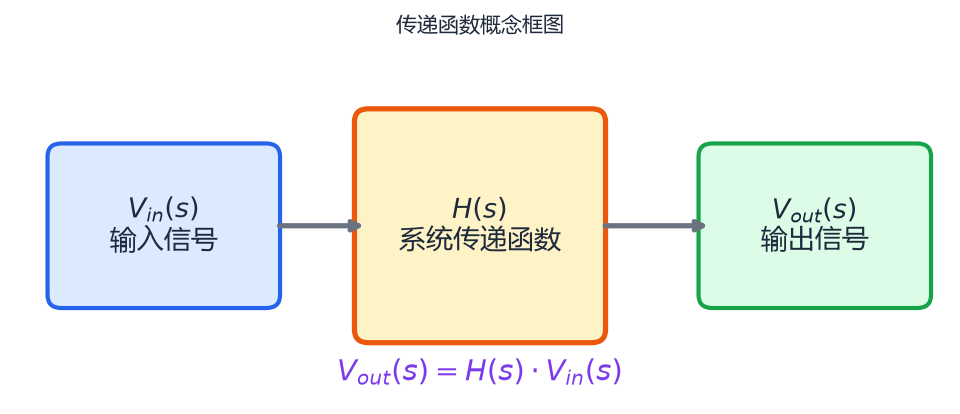
*图1-1 传递函数概念框图：输入信号 Vin(s) 经系统 H(s) 变换后得到输出 Vout(s)*

- 传递函数 $H(s)$ 中的 $s$ 是"复频率"，它**可以代表所有信号情况**（正弦波、方波、突变、衰减……全都能描述）。
- 我们做环路补偿**只关心正弦波**，此时 $s=j\omega$，剩下的可变参数**只剩下频率 $\omega$ 一个**。
- $\omega$（omega）= 角频率，用来表示一个信号的频率（$\omega = 2\pi f$）。

## 2. j 是什么？对应波特图里的什么？

- $j$ 是虚数单位（工程师写法，数学家写 $i$），性质 $j^2=-1$
- 用复数表示一个正弦波，一个复数自带两个信息：
  - **模长** = 信号"多大" → 对应波特图的 **增益**（dB）
  - **角度** = 信号"转了多大角度" → 对应波特图的 **相位**（Deg）
- 比如波特图上某点显示"**增益 20dB、相位 -45°**"，就是在说：这个频率的信号过系统后，**大小变成原来的 10 倍，时间上往后挪了 45°**。
- 实测时仪器直接给出增益和相位，$j$ 就在里面

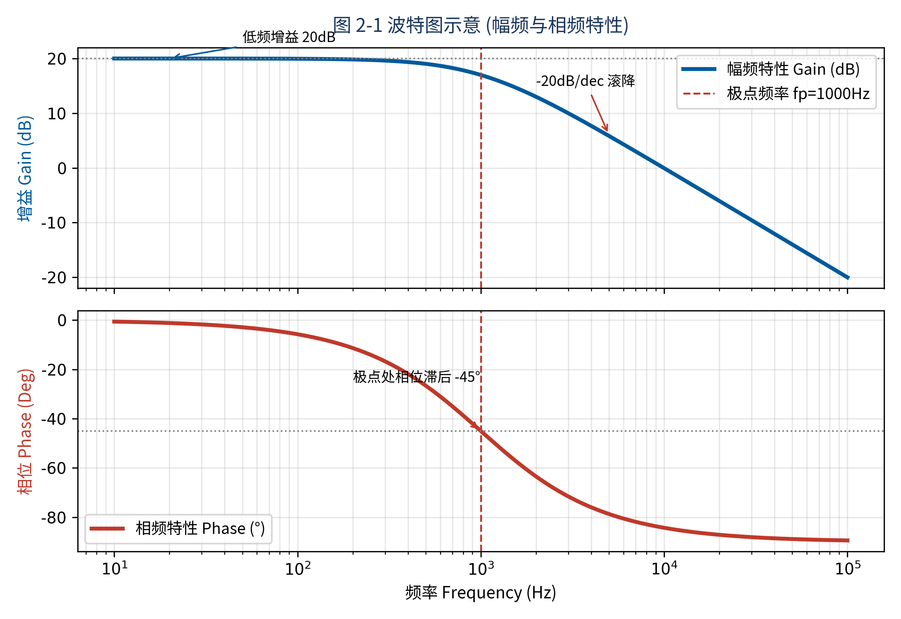
*图2-1 波特图示意：上图为幅频特性（增益 dB），下图为相频特性（相位 °），横轴为频率（对数刻度）*

### 2.1 阻抗：交流下的"等效电阻"

- 交流（正弦）电路里，电阻、电感、电容各自对电流的"阻碍能力"叫**阻抗**（复数，自带大小和角度），用 $s$ 表示：

| 元件 | 阻抗 |
|---|---|
| 电阻 | $R$ |
| 电感 | $sL$ |
| 电容 | $\dfrac{1}{sC}$ |

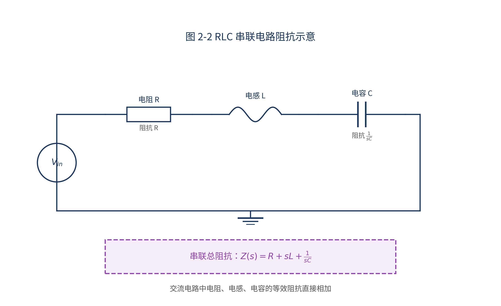
*图2-2 RLC 串联电路阻抗示意：Z总 = R + sL + 1/(sC)，阻抗可直接相加*

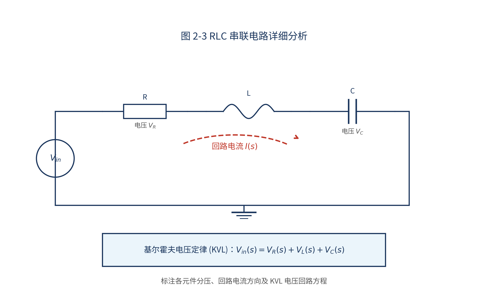
*图2-3 RLC 串联电路详细分析：标注各元件电压（VR、VL、VC）、电流方向 I、及 KVL 方程 $V_{in}=V_R+V_L+V_C$*

- 有了阻抗，交流电路就能像直流电阻电路一样算（欧姆定律、分压公式都能用）。
- 串联元件**阻抗直接相加**：$Z_{总}=R+sL+\dfrac{1}{sC}$

## 3. 傅里叶变换：把复杂信号拆成正弦波

- **任何**复杂的、乱七八糟的信号（方波、噪声、负载突变……）都可以用傅里叶变换拆成**一堆不同频率、不同大小、不同相位的正弦波叠加**。
- 比喻：任何颜色都能用红绿蓝三种光按不同比例混出来；任何波形都能用一堆正弦波按不同比例叠出来。

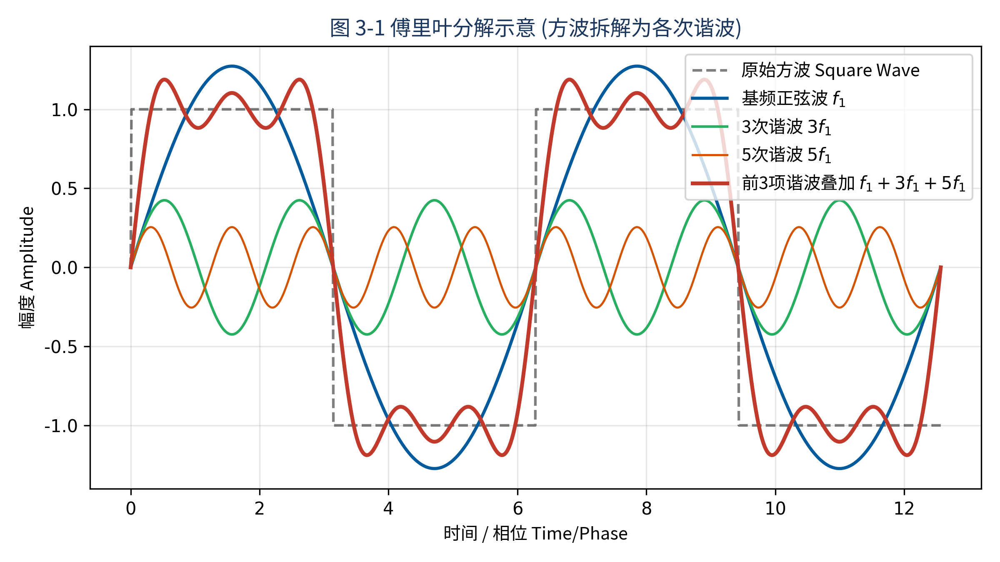
*图3-1 傅里叶分解示意：方波可拆解为基频及各次谐波正弦波的叠加*

## 4. 线性系统与叠加原理（为什么能"拆开算再相加"）

- **线性系统**：不同参数**各算各的、互不干扰，最后相加就是结果**。
- 因为是线性的，"**拆开算、再相加**"和"**整个塞进去算**"得到的结果**一模一样**。
- 拆开后每个分量都是正弦波，而**正弦波过系统的结果，用传递函数就知道**——所以拆开反而好算。

## 5. 应用到反激电源：输出波形 = 一堆正弦波的叠加

设计好的反激电源，实际输出波形本质上就是一堆频率分量叠出来的：

| 分量               | 来源       | 环路对待方式               |
| ---------------- | -------- | -------------------- |
| 直流分量             | 稳压输出 24V | 低频，**不能衰减**（要保证输出电压） |
| PFC 纹波（约 100Hz）  | 电网频率的两倍  | 环路要压低                |
| 开关频率纹波（约 150kHz） | 开关管工作    | 被衰减                  |
| 高频噪声             | 开关振铃等    | 被衰减                  |

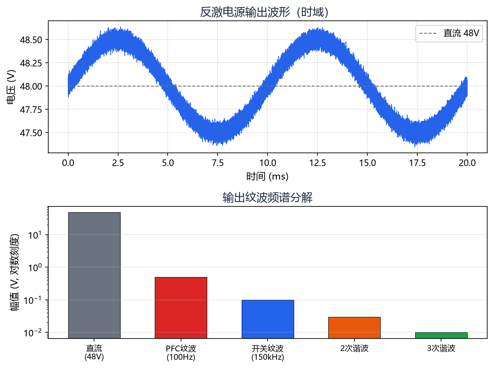
*图5-1 反激电源输出纹波频谱分解：直流分量 + 100Hz PFC 纹波 + 150kHz 开关纹波 + 高频噪声*

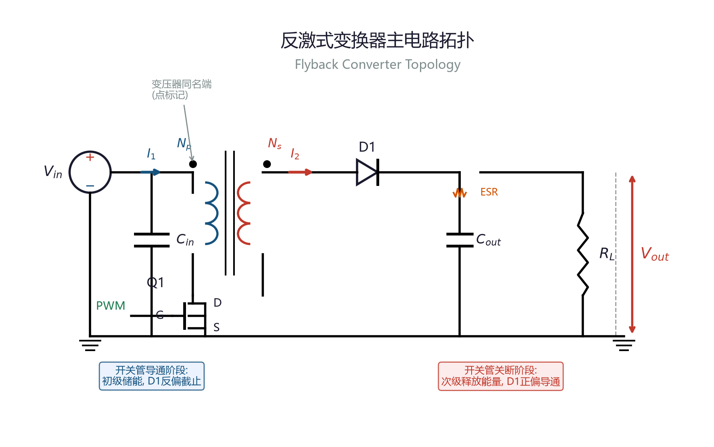
*图5-2 反激变换器主电路拓扑 (IEEE 标准)：Vin→MOS→变压器→D1→Cout→RL，开关管导通初级储能、关断次级释能*

- **每一个频率分量都被环路"区别对待"**：低频放大、开关频率和高频被衰减。
- 环路补偿要压低纹波，本质就是**让系统对那几个"噪声频率"待遇差**，同时保证直流分量不被衰减。
- 依靠**叠加原理**：每个分量单独处理完，**加起来就是示波器上看到的真实输出**。

## 6. 运算放大器的传递函数推导

**电路拓扑**（T 型反馈网络）：

- $V_{in}$ —$Z_1$—> 节点 $V_1$（运放反相输入端）
- $V_1$ —$Z_2$—> GND
- $V_1$ —$Z_3$—> 运放反相输入端（虚短为 0V）
- $V_1$ —$Z_4$—> $V_{out}$
- $V_{out}$ —$Z_5$—> 运放反相输入端（虚短为 0V）

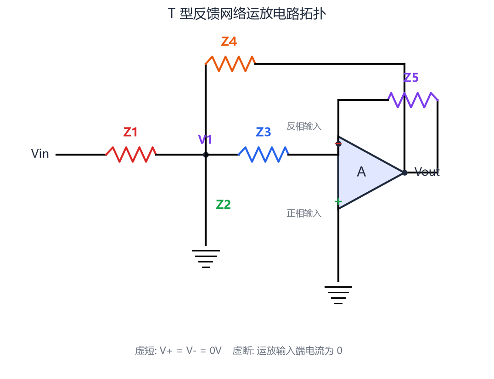
*图6-1 T 型反馈网络运放电路拓扑：Z1~Z5 构成 T 型反馈结构，利用虚短虚断推导传递函数*

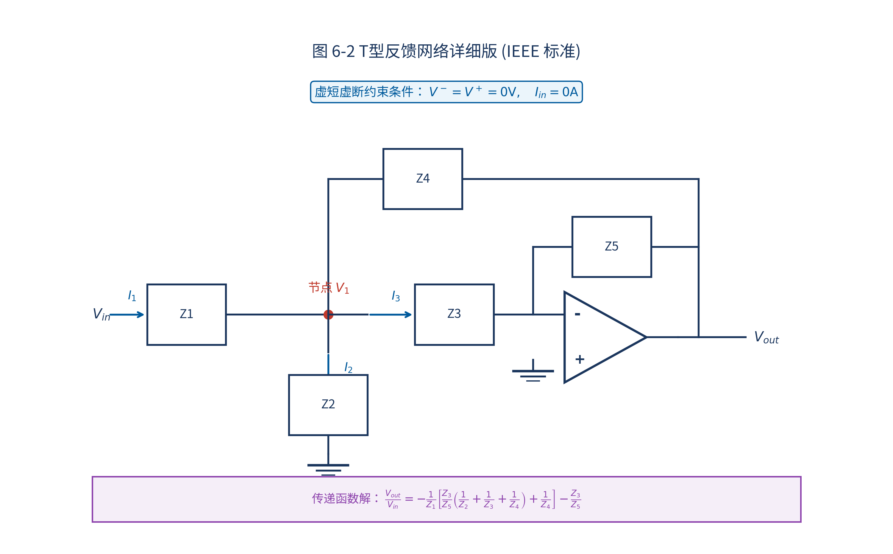
*图6-2 T 型反馈网络详细版（IEEE 标准）：标注各节点电压（V1、V⁺ = V⁻ = 0V）、电流方向（I1、I3、I5、If）、虚短虚断条件*

**推导：**

1. 放大器正相端接地，根据**虚短**，负相端也为 0V。
2. 节点 $V_1$ 处电流和为 0：

$$\frac{V_{in}-V_1}{Z_1}=\frac{V_1}{Z_2}+\frac{V_1}{Z_3}+\frac{V_1-V_{out}}{Z_4}$$

3. 虚短 → 运放输入端电流为 0，流过 $Z_3$ 的电流等于流过 $Z_5$ 的电流：

$$\frac{V_1-0}{Z_3}=\frac{0-V_{out}}{Z_5}$$

4. 联立上面两个式子，解得传递函数：

$$\frac{V_{out}}{V_{in}}=-\frac{1}{Z_1}\left[\frac{Z_3}{Z_5}\left(\frac{1}{Z_2}+\frac{1}{Z_3}+\frac{1}{Z_4}\right)+\frac{1}{Z_4}\right]-\frac{Z_3}{Z_5}$$

>虚短/虚断是列方程的两个关键依据。

## 7. 零点和极点是什么

任何传递函数都能写成"**分子 ÷ 分母**"：

$$H(s)=\frac{分子}{分母}$$

- **分子 = 0 的频率 → 零点**
- **分母 = 0 的频率 → 极点**

它们是两个**特殊的频率点**，也是波特图上斜率变化的"拐点"。

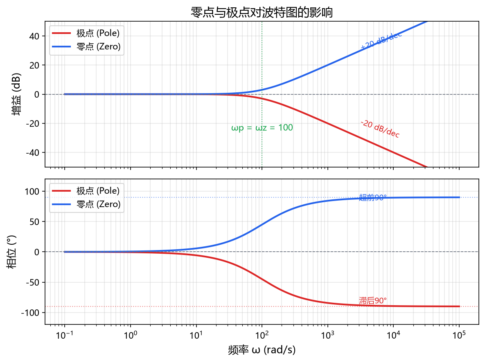
*图7-1 零点与极点对波特图的影响：极点处增益以 -20dB/dec 滚降、相位滞后 90°；零点处增益以 +20dB/dec 上升、相位超前 90°*

### 极点：系统"跟不上"的地方（高频被砍）

- 信号变化太快，系统反应不过来，输出被削掉。
- 从极点频率开始，增益以 **-20dB/十倍频** 滚降，相位**滞后**，最终滞后 90°。
- 例：RC 低通 $H(s)=\dfrac{1}{1+sRC}$，极点 $f_p=\dfrac{1}{2\pi RC}$——低于 $f_p$ 增益平坦，高于 $f_p$ 开始滚降。

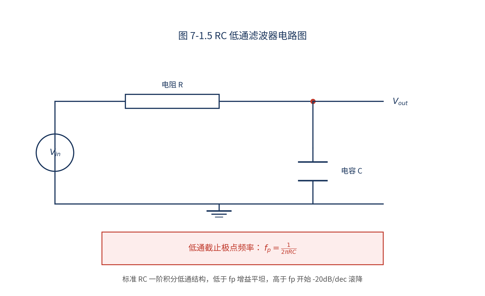
*图7-1.5 RC 低通滤波器电路图：标注 R、C 元件、电流方向 I、输出电压 Vout 及极点公式 $f_p=1/(2\pi RC)$*

### 零点：系统"发力"的地方（增益被顶起来）

- 与极点相反：从零点频率开始，增益以 **+20dB/十倍频** 上升，相位**超前**，最终超前 90°。

### 波特图上的"拐点开关"

| 遇到 | 斜率变化 | 相位变化 |
|---|---|---|
| 极点 | 每过 1 个，斜率 -20dB/dec | 滞后 90° |
| 零点 | 每过 1 个，斜率 +20dB/dec | 超前 90° |

多个极零点叠加时，斜率像"数数"一样逐个累加。

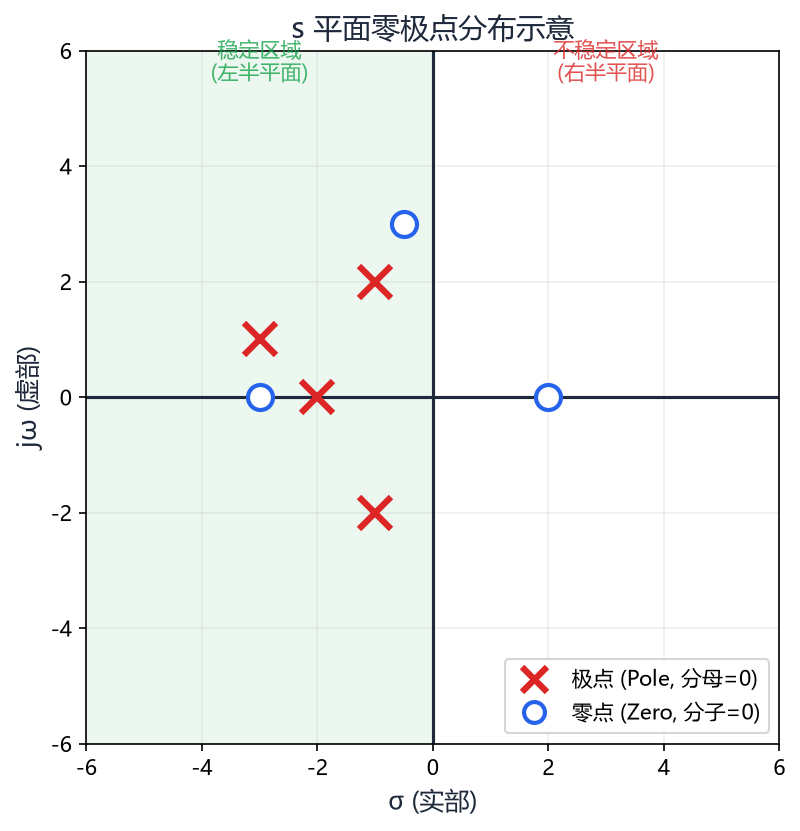
*图7-2 s 平面零极点分布示意：× 为极点（分母=0），○ 为零点（分子=0），均为波特图斜率变化的拐点*

### 在电源环路里它们是谁？

| 环路里的东西 | 产生 | 作用 |
|---|---|---|
| 输出电容 + 负载 | **极点**（低频） | 让系统从某个频率开始滚降 |
| 输出电容的 ESR | **零点** | 把滚降"抬回来"一点，稳住相位 |
| 补偿网络的 RC | 人为的**零点和极点** | 去"抵消/矫正"功率级自带的零极点 |

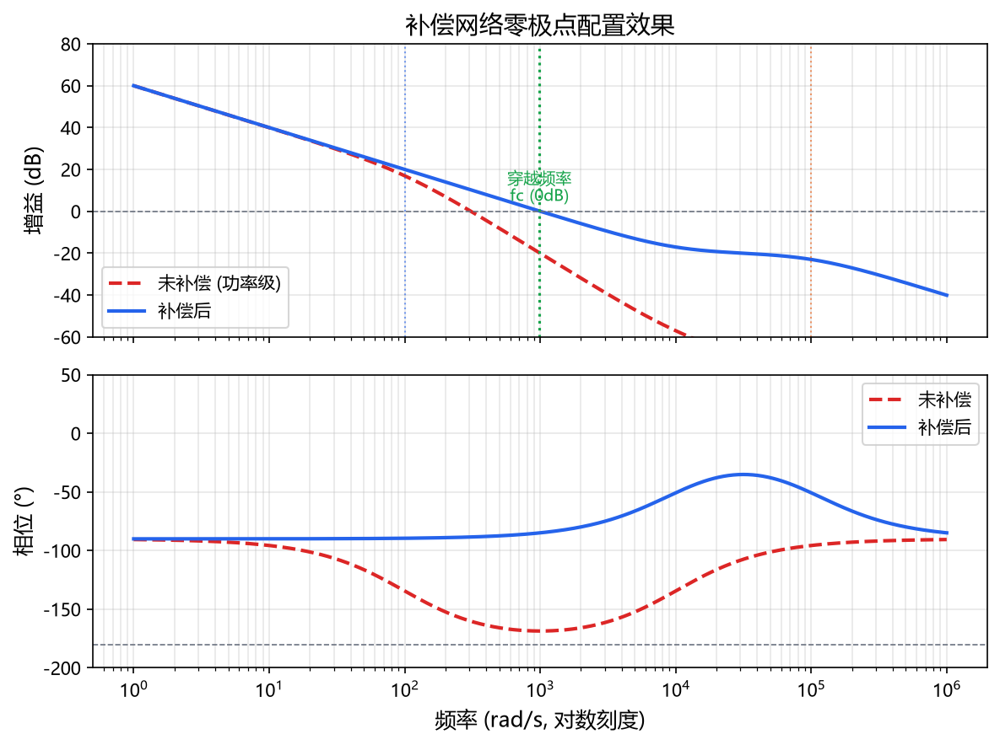
*图7-3 补偿网络零极点配置示意：人为放置零极点去矫正功率级自带的零极点，使穿越频率处斜率为 -20dB/dec*

### s 平面零极点分布（实部 / 虚部 / 左右半平面）

**s 平面 = 复平面**，$s=\sigma+j\omega$：

- **横轴：实部 $\sigma$** —— 管"涨落的方向和速度"（信号是越来越大还是越来越小）
- **纵轴：虚部 $j\omega$** —— 管"振荡的快慢"（频率）
- 比喻：荡秋千，$\omega$ 是荡的频率，$\sigma$ 是顺风/逆风（加力/阻力）

**为什么左半平面稳定、右半平面不稳定：**

信号随时间变化写成 $e^{(\sigma+j\omega)t}=e^{\sigma t}\cdot e^{j\omega t}$：
- $e^{j\omega t}$：只负责振荡（来回抖），幅度不变；
- $e^{\sigma t}$：负责涨落，**这是关键**。

| 极点位置 | $\sigma$ | $e^{\sigma t}$ | 结果 |
|---|---|---|---|
| **左半平面**（稳定区域） | $\sigma<0$ | 越来越小 | 扰动被衰减 → **稳定** ✅ |
| **虚轴上** | $\sigma=0$ | 不变 | 等幅振荡（临界）⚠️ |
| **右半平面**（不稳定区域） | $\sigma>0$ | 越来越大 | 扰动发散 → **不稳定** ❌ |

- 图上 **X = 极点**（分母=0），**O = 零点**（分子=0）；
- **判断系统稳不稳，只看极点**：所有极点都在左半平面 → 稳定；任何一个跑到右半平面 → 不稳定。

**和前面内容的联系：**

1. **相位裕度 > 0 等价于"所有闭环极点都在左半平面"**——裕度越大，极点离虚轴越远，越稳、响应越利落；
2. **RHP 零点**（右半平面零点）为什么可怕：左半平面零点带来**相位超前**（救火），右半平面零点带来**相位滞后**（帮倒忙）——这就是反激 RHP 零点拉低相位裕度、限制带宽的原因；
3. **振铃的物理来源**：极点离虚轴很近（$\sigma\approx 0$）时，系统"勉强稳住但接近临界"，负载突变就会来回振铃——即相位裕度小、过冲大的另一种说法。

**总结：**
> 补偿网络设计的本质，就是"放几个零点和极点，去跟功率级自带的零极点打架"**，最后让波特图在穿越频率处斜率、相位都合适——系统就稳定了。

## 8. 脉冲调制器与线性化条件

开关电源通过**控制每个开关周期内的导通/关断时间**来控制输出电压，起决定作用的就是 **PWM 的占空比 $d$**，因此把占空比 $d$ 作为脉冲调制器这一级的输出信号。

电压比较中，蓝色是采样输出的电压信号(Vt)
![[Pasted image 20260808153250.png]]
![[Pasted image 20260808151740.png]]
- **占空比 $d$** = 每个开关周期内 PWM 高电平所占的时间百分比；**一个周期只有一个值，一个周期也只能调整一次**。
- 示意图（PWM 的产生）：$V_c(t)$ 与锯齿波**电压比较** → 得到**开关波形**（每个周期占空比不同 $d_1,d_2,d_3,d_4$）→ 把占空比画出来是一串**离散的点**。

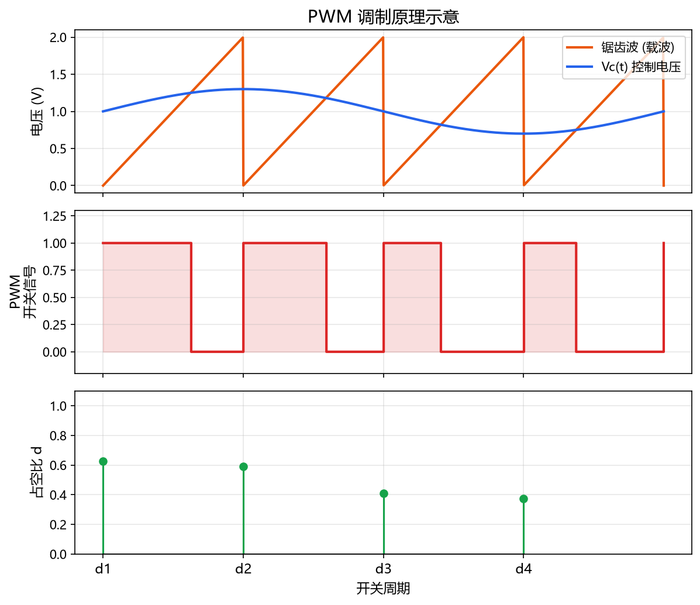
*图8-1 PWM 调制原理示意：控制电压 Vc(t) 与锯齿波比较，产生占空比可变的开关信号，采样频率 = 开关频率*

- **像 AD 采样**：输入 $V_c(t)$ 是连续信号，输出占空比 $d$ 是离散点——每个开关周期对 $V_c(t)$ 采样一次，**采样频率 = 开关频率**。
- **采样率够高时**，采样点连起来的形状 ≈ $V_c(t)$，输出 $d$ 与输入 $V_c(t)$ 就近似**线性**。
- **线性化条件**：根据奈奎斯特采样定律，采样率 ≥ 2 × 信号频率 → 即 **$V_c(t)$ 的频率不能超过开关频率的 1/2**。

> 这也是为什么常说"**环路的穿越频率理论上要小于开关频率的 1/2（实际一般都设 1/5 以下）**"——如果穿越频率超过开关频率的 1/2，系统就不能再当线性系统看，穿越频率这个概念本身就失去意义了（因为它建立在"线性化"的基础上）。

## 9. 穿越频率

**一句话定义：环路增益恰好等于 1（0dB）时的那个频率。**

- 低频时环路增益很大（比如 60dB = 放大 1000 倍），稳压才稳；频率越高增益越往下掉；
- **增益曲线穿过 0dB 横线的那个点 = 穿越频率**（波特图上的"0dB 交叉点"）。

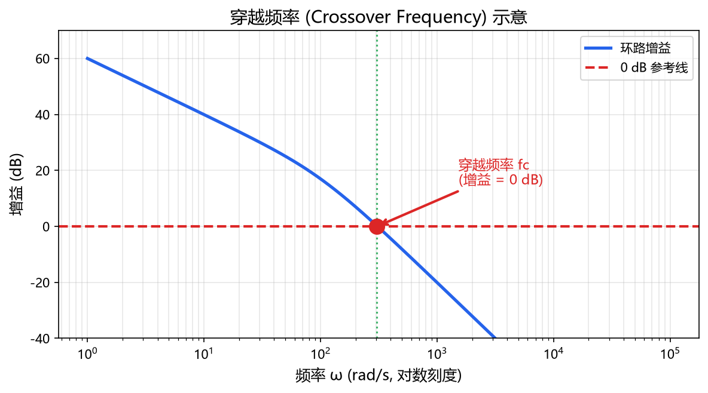
*图9-1 穿越频率示意：环路增益曲线穿越 0dB 横线的频率点，决定系统的反应速度*

**它是系统的"反应速度"：**

- 穿越频率**高** → 系统反应快 → 负载突变时电压波动小、恢复快
- 穿越频率**低** → 反应慢 → 负载突变时电压掉得多、恢复慢

**为什么不能无限提高？——穿越频率处的相位裕度决定稳定性**

- 穿越频率太高时，该处相位滞后太多（极点拉下来的），超过 180° 就振荡；
- 所以补偿网络的目标：**把穿越频率放在"够快但不振荡"的位置，并保证该处相位裕度足够（通常 45°~60°）**。

**电源里的典型数字：**

| 电源 | 穿越频率 | 原因 |
|---|---|---|
| PFC 环路 | 10~20 Hz 左右 | 只处理 100Hz 电网纹波，不需要快 |
| 反激 DC-DC 环路 | 1~3 kHz 左右 | 要应对负载突变，需要快一点 |
| 反激不能更高 | 受 RHP 零点限制 | 高于 RHP 零点 1/5 会不稳定 |

> 呼应第 7 节：**补偿网络 = 用零点极点把穿越频率放到合适位置，并保证穿越频率处相位裕度足够。**

## 10. 相位裕度：为什么必须"够用"

### 10.1 负反馈天生"反着干"（那 180° 从哪来）

环路是**负反馈**：输出电压偏高 → 环路去压它；偏低 → 环路去抬它。**它天生就"反着干"**，这个"反着干"就是 180° 相移的来源（负号 = 反着来 = 180°）。

信号绕环路一圈的总相位里，**已经包含了这 180°**。

### 10.2 问题根源：信号会"迟到"（相位滞后）

信号在环路里绕一圈（补偿器 → PWM → 功率级 → 反馈 → 回来），每一级都会让信号**迟到一点**（相位滞后）。

- 迟到本身没问题；
- 但**迟到太多，方向就反了**：本该"高了就压下去"，结果变成"高了反而推上去"——**纠错变成帮倒忙**。
- 这就是**正反馈**，越帮越乱，开始振荡。

### 10.3 振荡的两个条件（缺一不可）

| 条件 | 含义 |
|---|---|
| **增益 = 1（0dB）** | 信号绕一圈大小不变，能自我维持、不衰减 |
| **相位 = -180°** | 方向正好反了，变成正反馈 |

这两个条件**同时**在穿越频率处满足 → 振荡。这也是为什么穿越频率如此特殊——它恰好是"增益 = 1"的地方，**只差相位这一脚就出事**。

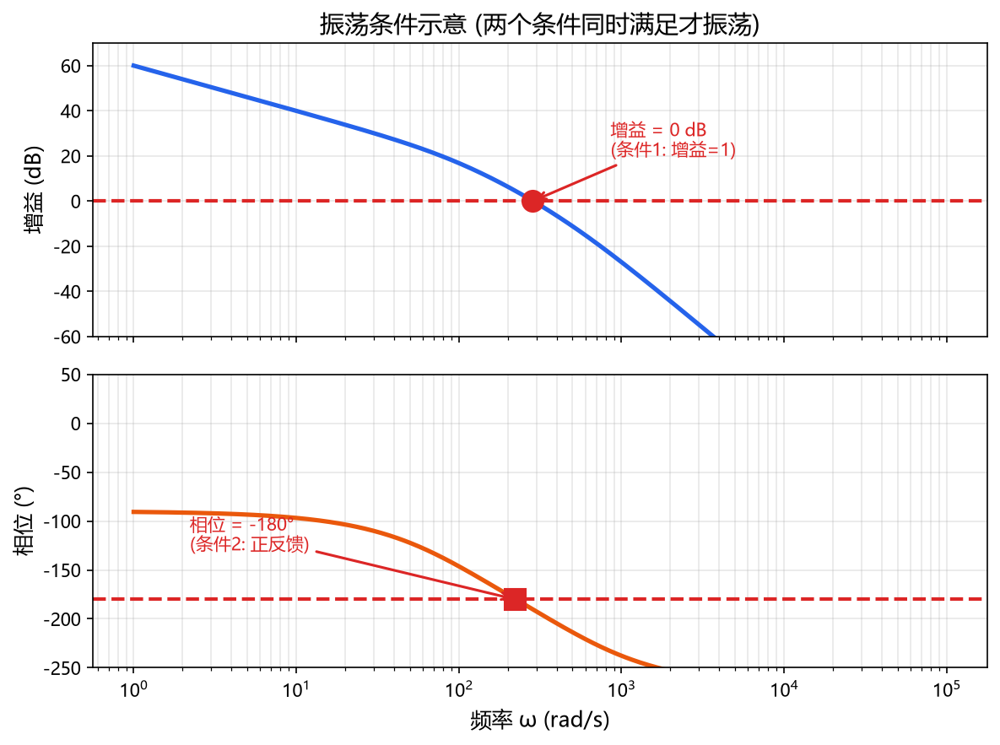
*图10-1 振荡条件示意：穿越频率处增益 = 0dB（上图）且相位 = -180°（下图）时系统振荡*

> 比喻：麦克风啸叫。音箱声音被麦克风拾到、放大、再放出来、再拾到……如果每次循环声音**不减反增**（增益>1）且**方向对得上**（相位对），就越叫越大。把音量调小（增益<1），每次循环都衰减，就不叫了。

### 10.4 澄清一个常见误区："开环" ≠ "去掉反馈"

你可能会想：既然是"开环"，那是不是把 H(s) 拿掉，只留 G(s)？**不是。**

"开环"指的是**把环路剪断**（环路不再闭合、不再有自动修正），但 H(s) 仍然作为被测环节留在回路里。因为判断稳定性的依据是"整个环"的总增益——信号从误差出发，经 G 到输出，再经 H 回到误差比较器，**这一整圈的增益**才决定会不会自激振荡。只算 G(s)（前向通路）是看不到 H(s) 的影响的。

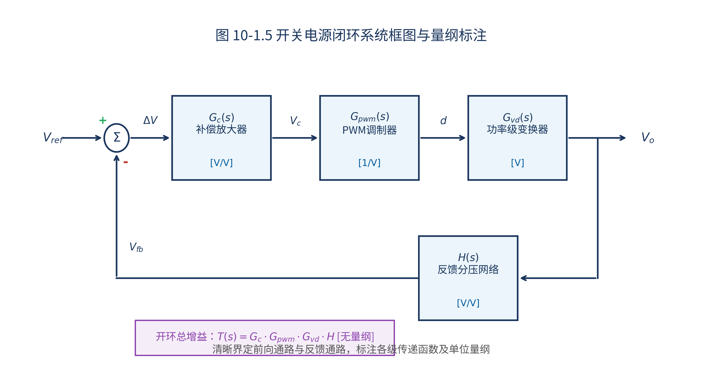
*图10-1.5 开关电源闭环系统框图：Vref→Σ→Gc→Gpwm→Gvd→Vo→H→反馈，含各级传递函数、开环增益 T(s)=Gc·Gpwm·Gvd·H、量纲校验*

假想把环路在误差比较器处**剪开**（这就是"开环"的含义）：

```
注入信号 x ──→ [G(s)] ──→ [H(s)] ──→ 回到断口的信号 = G(s)·H(s)·x
```

- 信号 x 经前向通路 G(s)，变成 $G(s)\cdot x$
- 再经反馈通路 H(s)，变成 $G(s)\cdot H(s)\cdot x$
- 回到断口的信号 ÷ 注入的信号 = $G(s)\cdot H(s)$

所以开环传递函数（环路增益）：

$$T(s)=\frac{\text{回到断口的信号}}{\text{注入断口的信号}}=G(s)\cdot H(s)$$

> 也就是说：**开环传递函数的"输入"和"输出"是同一个断口点**（信号绕一圈回到自己），所以它天然是沿途各环节的乘积 $G\cdot H$；它不是"系统输入→系统输出"的传递函数——那个是闭环传递函数 $C(s)=\dfrac{G(s)}{1+T(s)}$。

### 10.5 为什么"稳定性"要用开环 T，而不是闭环 C？

从闭环公式就能看出来：

$$C(s)=\frac{\Delta v_o}{\Delta v_{ref}}=\frac{G(s)}{1+T(s)}$$

系统不稳定的条件（第3章原文）：**分母为 0**，即 $1+T(s)=0$，也就是：

$$T(s)=-1 \quad\Longleftrightarrow\quad |T|=1,\ \angle T=-180°$$

也就是说，**当信号绕环路一圈后，幅度不变（|T|=1）且相位反相（-180°）**，那么绕回来的信号和注入的信号刚好同相叠加、自我维持——这正是振荡的物理条件！所以判断稳定性要看"绕一圈的增益" $T(s)$，而 $T(s)$ 恰好可以拆成各级乘积，方便逐级分析。

> 呼应 10.4：正因为 $T(s)$ 可以拆成 $G\cdot H$ 逐级分析，而闭环 $C(s)$ 取对数后（$\log C=\log G-\log(1+T)$）各级分不开，所以工程上判断稳定性用的都是**开环**波特图。

### 10.6 为什么画开环波特图，而不是闭环？（对数坐标的魔法）

但是如果有一定经验的话，就会知道，我们通常画的波特图并不是闭环传递函数 $C(s)$，而是开环传递函数 $T(s)$，这是为什么呢？

这是因为我们画的波特图通常是对数坐标，而**开环传递函数的表达式就是各级相乘的关系**，幅度取对数之后变成相加的关系，同时相位也是相加的关系。

$$T(s) = G(s) \cdot H(s) = G_C(s) \cdot G_{PWM}(s) \cdot G_{vd}(s) \cdot H(s)$$

转化为对数坐标后，为**相加的关系**：

- **幅度**：$\log_{10}T(s) = \log_{10}G_C(s) + \log_{10}G_{PWM}(s) + \log_{10}G_{vd}(s) + \log_{10}H(s)$
- **相位**：$\angle T(s) = \angle G_C(s) + \angle G_{PWM}(s) + \angle G_{vd}(s) + \angle H(s)$

这对于分析问题来说简直不要太方便，我们可以**单独分析各级的传递函数**，就可以知道它们对整个系统所起的作用了。

而闭环传递函数取对数之后是这个：$\log C(s) = \log\big(G(s)/(1+T(s))\big)$，各级之间区分不开，难以分析。

> 呼应 10.5：这就是为什么工程上判断稳定性都用**开环**波特图——开环可以逐级分解看每一级的贡献，闭环的 $\log(1+T)$ 是一个整体，拆不开。

### 10.7 相位裕度的定义

$$\text{相位裕度} = 180° + \text{（穿越频率处的环路相位）}$$

例：穿越频率处环路相位 = -120°，则裕度 = 180° - 120° = **60°**。

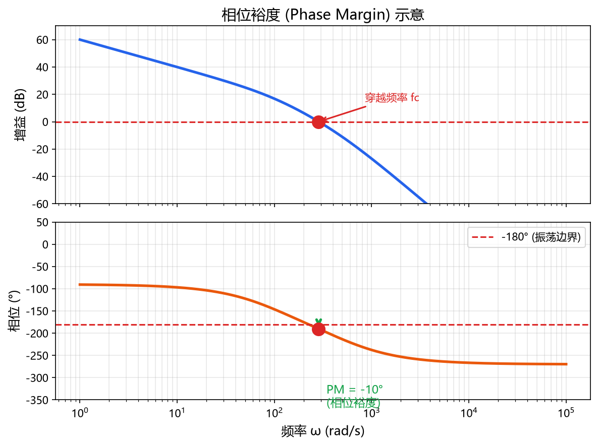
*图10-2 相位裕度示意：穿越频率处环路相位距 -180° 的角度差，工程推荐 45°~60°*

| 相位裕度 | 会发生什么 |
|---|---|
| 60°（推荐） | 安全，响应干脆利落 |
| 30°~45° | 勉强能稳，但阶跃响应**过冲大、来回振铃** |
| 0° | 临界，刚好要振不振 |
| 负值（如 -20°） | **振荡**，输出自己抖起来，停不下来 |

### 10.8 相位裕度影响什么？

1. **稳定性（底线）**：裕度 ≥ 0 才不振荡；
2. **动态质量**：
   - 裕度**太小**（如 20°）→ 负载突变时输出**冲过头、来回抖**（振铃）；
   - 裕度**合适**（45°~60°）→ 一次到位，干净利落；
   - 裕度**太大**（90° 以上）→ 稳但**反应迟钝**，像慢动作。

**45°~60° 是工程"甜点区"：既稳得住，又反应快。**

### 10.9 相位滞后 vs 相位超前

- **滞后（负相位）**：信号"迟到"。**几乎所有真实环节都会滞后**（电容、电感、功率级、光耦……），它是把环路往 -180° 推的**"元凶"**。
- **超前（正相位）**：信号"提前"。**只有零点能制造超前**，它是补偿网络手里的**"武器"**——专门用来对冲滞后、把穿越处的相位拉回安全区。

### 10.10 补偿网络到底在干什么（具体例子）

功率级 + 光耦 + …… 在穿越频率处贡献了一堆**滞后**，假设总共 -155°，眼看就要撞上 -180°：

1. 不补偿：裕度 = 180° - 155° = **25°，太小**，振铃严重；
2. 补偿网络放一个**零点**（制造 +45° 超前）→ 相位被拉回到 -110°；
3. 现在裕度 = 180° - 110° = **70° ✓ 安全了**。

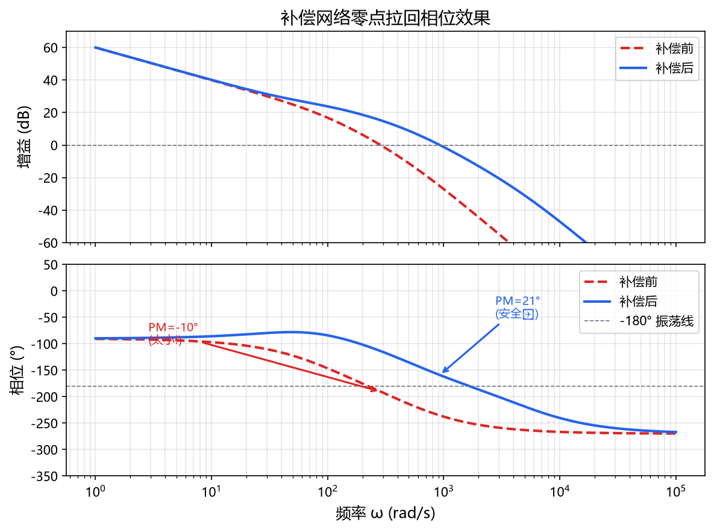
*图10-3 补偿网络零点拉回相位示意：人为引入零点制造相位超前，将穿越频率处相位裕度从 25° 提升至 70°*

> 这就是第 7 节说的"放零点和极点去跟功率级打架"：**零点（超前）是救火的，极点（滞后）常常是闯祸的**，补偿就是人为制造超前，把相位"抢"回安全区。


## 11. 开关电源线性化的三个条件

开关电源是"**开关**"的（管子一会儿通、一会儿断），天生不是线性系统。但我们想用传递函数/波特图分析它，就得"假装"它是线性的。**下面三个条件就是"假装"能成立的三个前提**——哪个不满足，假装就露馅。

### 11.1 低频假设（变化不能太快 = 干扰信号频率要低）

- 脉冲调制器像 AD 采样，**采样频率 = 开关频率**；
- 根据奈奎斯特定律：**采样率 ≥ 2 × 信号频率**，采样才不会失真；
- 所以**干扰信号频率 < 开关频率的 1/2**。
- 比喻：拍电影帧率就是采样率，动作太快帧率不够，就会看到"车轮倒转"这种假象（混叠）。
- 工程含义：**穿越频率 < 开关频率 1/2（实际都取 1/5 以下）**。
- 例：反激开关频率 ~150kHz，穿越频率设计在 1~3kHz，远低于 75kHz ✅

### 11.2 小信号假设（幅度不能太大 = 占空比只在小范围抖）

- 开关变换器 $V_o$ 与占空比 $d$ 的关系是**曲线**（如 BOOST：$V_o=V_i/(1-d)$），不是直线；
- 但**曲线的一小段可以近似成直线**（用切线/导数代替）；
- 所以**干扰幅度要小，占空比只在小范围 $\Delta d$ 内变化**，线性模型才成立。
- 比喻：地球表面是球面，但脚下的一小块地面就是平的。
- 失效后果：负载突变太猛、输入跳变太大时，占空比大幅摆动，跑出"小段直线"范围，**大信号动态不能完全用小信号模型预测**（要靠实测）。
- 例：占空比 40%→41% 线性 ✅；40%→70% 失真 ❌

### 11.3 小纹波假设（输出纹波很小，可忽略）

- 输出电压 = **平均值（直流）+ 开关频率纹波**；建模时看平均值的变化，**忽略纹波**；
- 纹波要**看相对值**（占输出电压的百分比）：1~5% 一般算"小"，但更准确的要求是**远小于直流平均值**；
- 深层原因：纹波太大 → 反馈（TL431/光耦）采样到的是**一直抖动的电压** → 误差放大器跟着抖 → 环路行为就乱了。纹波小 → 反馈看到近似稳定的直流 → 环路才能正常工作。
- 比喻：量体重看长期趋势，每天几两的波动忽略。
- 例：48V 输出、纹波实测 ~86.75mV ≈ **0.18%** ✅ 绰绰有余

### 11.4 三个条件总结表

| 条件 | 大白话 | 本质 | 不满足会怎样 |
|---|---|---|---|
| 低频假设 | 变化**不能太快** | 干扰频率 < 开关频率 1/2 | 采样失真，分析结果错 |
| 小信号假设 | 幅度**不能太大** | 占空比只在小范围变化 | 大跳变时模型不准 |
| 小纹波假设 | 抖动**不能太大** | 纹波远小于直流平均值 | 平均值不代表输出 |

## 12. 误差放大器的三种补偿与高频极点 fp

### 12.1 三种补偿 = 同一个普通放大器 + 不同的反馈阻抗 Z1

基于**普通放大器**（小信号下用虚短虚断、Vref 恒定），传递函数：

$$\frac{\Delta V_c}{\Delta V_o}=-\frac{Z_1}{R_1}$$

（**Rb 不出现在公式里**——分压网络只有上面的 R1 影响环路，下面 Rb 不影响）

三种补偿的区别**只在反馈阻抗 Z1**：

| 补偿方式 | Z1 | 传递函数 | 零极点 | 控制本质 | 特点 |
|---|---|---|---|---|---|
| **主极点** | $C_1$ | $-\dfrac{1}{sR_1C_1}$ | 原点极点 | 只有 I（纯积分） | 最稳但最慢 |
| **极零点** | $R_2+C_1$ | $-\dfrac{1+sR_2C_1}{sR_1C_1}$ | 原点极点 + 1 零点 | **PI** | 快 + 稳，最常用 |
| **双极点单零点** | $C_2//(R_2+C_1)$ | $-\dfrac{1+sR_2C_1}{sR_1(C_1+C_2)\left(1+s\dfrac{R_2C_1C_2}{C_1+C_2}\right)}$ | 原点极点 + 1 零点 + **1 高频极点** | PI + 高频极点 | 快 + 稳 + 压高频 |

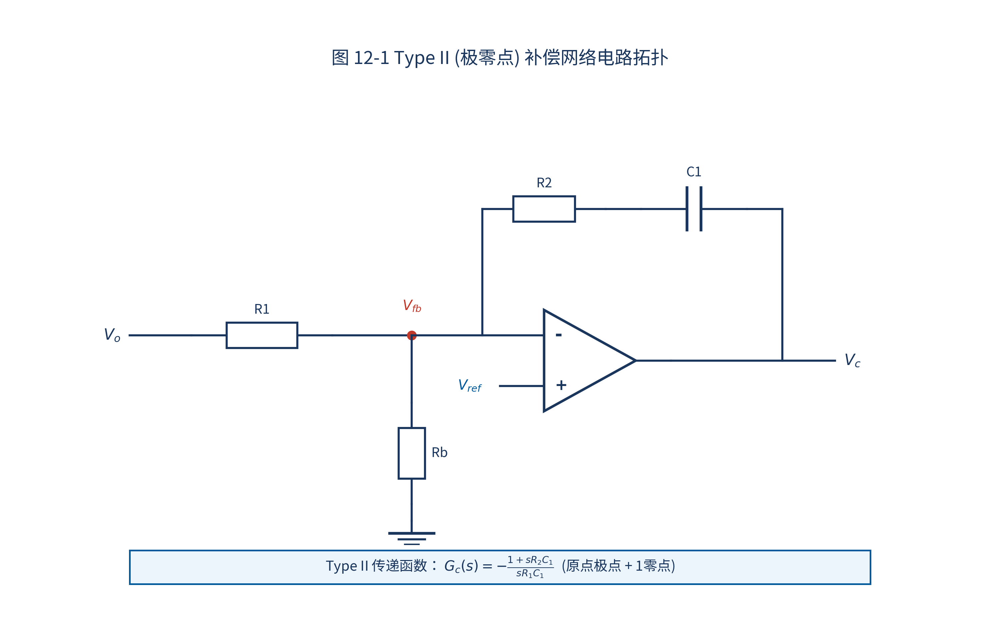
*图12-1 Type II (极零点) 补偿网络电路：R1/Rb 分压取样 Vfb，Z1 = R2 + C1 反馈到运放反相端，Z1 表达式及 PI 传递函数*

> **原点极点**：极点正好在 s=0（0 Hz），从最低频就开始起作用。积分器在直流附近增益无穷大（稳态无差），随频率升高以 -20dB/dec 滚降、相位恒定——"低频增益无穷大"说的是最左端（f→0）的起点，"一路滚降"说的是从左往右看。两者不矛盾。
>
> **PI = PID 里的比例-积分**：极零点补偿展开后 $-\dfrac{R_2}{R_1}-\dfrac{1}{sR_1C_1}$——第一项是 P（比例，由 R2 决定中频平坦增益），第二项是 I（积分，由 C1 保证直流无差），所以极零点补偿本质上就是 PI 控制器；它的零点 $f_z=\dfrac{1}{2\pi R_2C_1}$ 是 P、I 结合时**自然产生**的（不是额外加的）。

### 12.2 双极点单零点：高频极点 fp 是怎么来的（重点）

高频极点 fp **完全是 C2 这个新加的小电容"干的好事"**。网络结构：

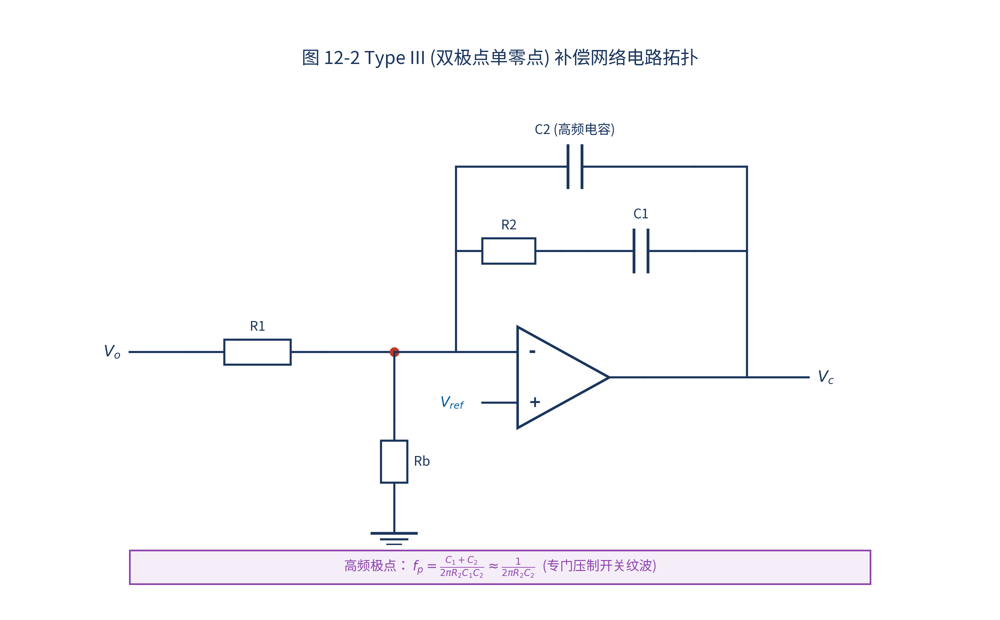
*图12-2 Type III (双极点单零点) 补偿网络电路：Z1 = C2 ∥ (R2 + C1)，含原点极点 + 零点 fz + 高频极点 fp*

```
        ┌── C2 ──┐
Vc ─────┤        ├───── 反相输入端（虚短 = 0V）
        └── R2 ── C1 ──┘
```

- **C1**：主补偿电容（大，如 10nF）
- **R2**：串联电阻（如 10kΩ）
- **C2**：新加的小电容（如 1nF），直接跨在输出和反相端之间

**一句话：高频极点 = "频率高到 C2 开始起作用"的那个频率。**

#### ① 分频段看电路退化成什么（最直观）

取 $R_2=10k\Omega,\ C_1=10nF,\ C_2=1nF$，则零点 $f_z\approx1.6\text{kHz}$、高频极点 $f_p\approx17.5\text{kHz}$：

| 频段 | C1 阻抗 vs R2 | C2 阻抗 vs R2 | 反馈网络变成 | 增益斜率 |
|---|---|---|---|---|
| $f<1.6\text{k}$ | C1 阻抗大（近开路） | C2 阻抗大（近开路） | 只有 C1 积分 | -20dB/dec（原点极点）|
| $1.6\text{k}<f<17.5\text{k}$ | C1 阻抗 < R2 → 支路 ≈ R2 | C2 阻抗 **>** R2 → C2 不通 | ≈ **R2**（平坦） | 0dB/dec（零点顶平）|
| $f>17.5\text{k}$ | C1 早已短路 | C2 阻抗 **<** R2 → C2 接管 | ≈ **C2** | 又 -20dB/dec（**高频极点**）|

关键在最后一行：**当 C2 阻抗降到小于 R2 时，C2 短路掉 R2、接管反馈路径**，阻抗重新以 -20dB/dec 下降 → 增益再往下掉，这就是高频极点。

#### ② fp 的物理判据：C2 阻抗 = R2 的频率

"接管"发生在 $\left|\dfrac{1}{j\omega C_2}\right|=R_2$ 时：

$$\frac{1}{2\pi f C_2}=R_2 \;\Longrightarrow\; \boxed{f_p\approx\frac{1}{2\pi R_2C_2}}$$

#### ③ 精确公式与推导

精确式多考虑了 C1（它不是理想短路）。并联阻抗 $Z_1=C_2//(R_2+C_1)$ 通分化简：

$$Z_1(s)=\frac{1+sR_2C_1}{s(C_1+C_2)\left(1+s\cdot\dfrac{R_2C_1C_2}{C_1+C_2}\right)}$$

分母括号项 = 0 即极点：$1+s\cdot\dfrac{R_2C_1C_2}{C_1+C_2}=0$，取绝对值换算成频率：

$$\boxed{f_p=\frac{C_1+C_2}{2\pi R_2C_1C_2}}\ \xrightarrow{C_1\gg C_2}\ \frac{1}{2\pi R_2C_2}$$

#### ④ 用"第8章快速法"再验证一遍

第8章讲过：反馈网络是**并联结构**时，**各支路阻抗相加 = 0** 算出的点就是极点：

$$R_2+\frac{1}{sC_1}+\frac{1}{sC_2}=0 \;\Longrightarrow\; f_p=\frac{C_1+C_2}{2\pi R_2C_1C_2}$$

两种方法，同一个答案 ✅

#### ⑤ 为什么要这个高频极点？

- 零点 $f_z$（≈1.6k）负责**提相位、加快响应**；
- 但过零点后增益变平坦（0dB/dec），意味着**开关频率附近增益还很高**，纹波/噪声畅通无阻；
- 高频极点 $f_p$（≈17.5k）负责在**开关频率之前把增益再压下去**——专门压制开关纹波和高频噪声。

所以"双极点单零点" = **原点极点**（积分保无差）+ **高频极点**（压高频）+ **一个零点**（提相位）。

> **一句话总结**：高频极点 fp 就是"C2 阻抗降到等于 R2"的频率（≈ 1/2πR2C2）。高于它，C2 短路掉 R2、接管反馈，增益重新 -20dB/dec 下降，从而压制开关频率附近的纹波和噪声。

### 12.3 量纲 vs 无量纲（验证模型自洽的工具）

**量纲 = 物理量的单位类别**（V、A、Ω、Hz……）。判断一个量"有没有量纲"的**实用标准**：把它看成"两个物理量之比"，看**单位能不能约掉**。

- **有量纲**：单位约不掉。例：跨导 $g_m=\dfrac{I_{out}}{V_{in}}$，单位 **A/V** = 导纳 = 西门子 S（第4章原文："从量纲上看，A/V = 电流/电压 = 1/电阻 = 导纳"）
- **无量纲**：单位约掉，只剩纯数字。例：增益 $\dfrac{V_{out}}{V_{in}}$（V/V）、占空比 d（s/s）、CTR $\dfrac{I_c}{I_f}$（A/A）、效率（W/W）、dB 值

| 量 | 表达式 | 单位 | 量纲？ |
|---|---|---|---|
| 电压增益 | $V_{out}/V_{in}$ | V/V → 抵消 | 无量纲 |
| 占空比 d | 导通时间/周期 | s/s → 抵消 | 无量纲 |
| 电流传输比 CTR | $I_c/I_f$ | A/A → 抵消 | 无量纲 |
| 效率 | 输出功率/输入功率 | W/W → 抵消 | 无量纲 |
| dB 值 | $20\log_{10}(V_2/V_1)$ | 无量纲比值的对数 | 无量纲 |
| 跨导 gm | $I_{out}/V_{in}$ | A/V → 约不掉 | **有量纲** |

> 一句话：**两个同量纲的量相除 → 无量纲；不同量纲的量相除 → 有量纲。**

#### 环路里各级的量纲（最容易混淆）

$$T(s) = \underbrace{H(s)}_{\text{V/V 无量纲}} \cdot \underbrace{G_c(s)}_{\text{V/V 无量纲}} \cdot \underbrace{G_{pwm}(s)}_{\text{1/V}} \cdot \underbrace{G_{vd}(s)}_{\text{V}}$$

- $G_{pwm}(s)=1/V_m$：输入是电压（V），输出是**占空比**（无量纲）→ 量纲 **1/V**
- $G_{vd}(s)=\hat{v}_o/\hat{d}$：输入是占空比（无量纲），输出是电压（V）→ 量纲 **V**

四级相乘：$1\times 1\times \dfrac{1}{V}\times V = 1$ → **T(s) 无量纲** ✅

**为什么 T(s) 必须无量纲**：穿越频率判据是 $|T|=1$（0 dB），而 **dB 是对无量纲比值的对数**——T 若带单位，"0 dB" 就失去意义了。

#### 量纲分析的用途

- **验证模型自洽**：推导出的 T(s) 若量纲不是 1，说明某级模型写错了；
- **确认物理量性质**：如 gm 的量纲 A/V = 1/Ω，推出它和电阻互为倒数、同属导纳/阻抗家族；
- **检查公式**：推导传递函数后看量纲对得上对不上，对不上必定某步出错。

### 12.4 跨导放大器：推导 + 与普通放大器对比

#### 电路结构与推导

电路：Vo → **Zin（上电阻）** → 分压点 Vfb → **Rd（下电阻）** → GND；Vfb 接跨导放大器反相端（-），Vref 接同相端（+）；输出电流 $I=g_m(V_{ref}-V_{fb})$ 流入**输出端阻抗 Zo**。

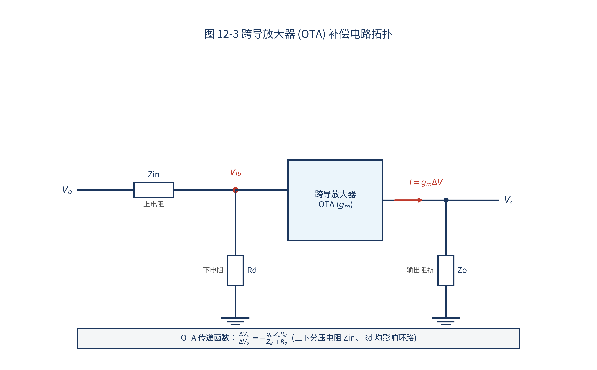
*图12-3 跨导放大器(OTA)补偿电路：Vo→Zin→Vfb→Rd→GND 分压，OTA 输出电流 I=gm(Vref-Vfb)，输出端阻抗 Zo(R2+C1)作补偿位置*

1. 分压：$\Delta V_{fb}=\Delta V_o\cdot\dfrac{R_d}{Z_{in}+R_d}$
2. 跨导定义（虚断，输入阻抗→∞）：$\Delta I = -g_m\,\Delta V_{fb}$
3. 输出端电压（电流压到 Zo 上）：$\Delta V_c = \Delta I\cdot Z_o$

$$\boxed{\frac{\Delta V_c}{\Delta V_o}=H(s)\cdot G_c(s)=-\frac{g_m\,Z_o\,R_d}{Z_{in}+R_d}}$$

#### 看最终表达式：谁影响环路？

| | 传递函数 | 出现的参数 | 谁影响环路 |
|---|---|---|---|
| 普通放大器 | $-\dfrac{Z_1}{R_1}$ | Z1、R1 | 只有上电阻 R1；下电阻 Rb **不影响** |
| 跨导放大器 | $-\dfrac{g_m\,Z_o\,R_d}{Z_{in}+R_d}$ | gm、Zo、Zin、Rd | **两个分压电阻都影响** |

**方法**：把传递函数化简到最终表达式，**式子里出现的参数就影响环路，没出现的就不影响**。

#### Zo 是"输出端"阻抗，不是输入阻抗（命名陷阱）

- **Zin**：`in` = input，输入端的**上分压电阻**（接 Vo 那侧）
- **Rd**：分压网络的**下电阻**（接地）
- **Zo**：`o` = **output（输出端）**——跨导放大器**输出端**所接的阻抗

**为什么补偿电路 = Zo？** 两种放大器输出类型不同：

| | 普通放大器 | 跨导放大器 |
|---|---|---|
| 输出 | **电压源**（低阻） | **电流源**（高阻，输出电流 $I=g_m\Delta V$）|
| 要变成电压 | 反馈阻抗 Z1 直接决定增益 | 电流必须**流过输出端阻抗 Zo** 才能变电压 |
| 补偿位置 | **Z1**（反馈路径上的阻抗） | **Zo**（输出端，电流→电压的转换阻抗）|

跨导放大器输出电流 $I$，而 PWM 比较器要的是电压：$V_c = I\cdot Z_o$。Zo 的 R、C 组合的频率特性决定了 Vc 随误差变化的规律 → **它就是补偿网络**。

> 类比：普通放大器像"自己会输出电压的电池"，用反馈电阻定增益；跨导放大器像"只往外灌电流的水泵"，必须接个"水阻"（Zo）才能看到压力（电压）——这个水阻就是补偿。

#### 第4章结论回顾

| | 普通放大器 | 跨导放大器 |
|---|---|---|
| 分析方法 | 虚短 + 虚断 | 只有虚断（输入阻抗→∞）|
| 分压电阻 | 只有上电阻影响 | 上下两个都影响 |
| 补偿位置 | 跨接输入/输出（Z1）| 输出端一头接地（Zo）|
| 典型芯片 | 通用运放 | MP1484（Gea）、CA3080 |

## 13. 脉冲调制级传递函数 Gpwm（第5章）

### 13.1 这一级是干什么的

- **输入**：误差信号 $V_c(t)$（放大补偿级的输出，模拟电压）
- **输出**：PWM 的**占空比 $d$**（不是电压信号！占空比才是真正控制开关变换器的东西）

### 13.2 PWM 的产生原理

芯片内部产生**固定锯齿波**（频率 = 开关频率），把 $V_c(t)$ 与锯齿波实时比较：

- $V_c(t)$ > 锯齿波电压 → 输出**高**
- $V_c(t)$ < 锯齿波电压 → 输出**低**

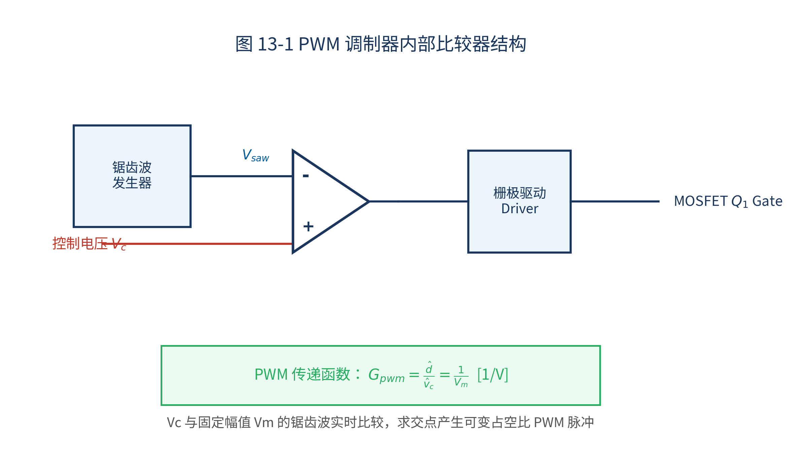
*图13-1 PWM 调制器内部结构：锯齿波发生器→比较器(Vc与锯齿波)→Driver→MOSFET Gate，含 Vc 比锯齿波求交点示意*

每个周期内 Vc 与锯齿波相交一次，**相交时电压决定占空比**：

| 相交时电压 | 占空比 |
|---|---|
| $V_m$ | 100% |
| $\frac{1}{2}V_m$ | 50% |
| 0 | 0% |

### 13.3 关键：一个开关周期内的波形与占空比推导

一个开关周期（$T_{sw}$）内：

- **锯齿波**：从 0 线性上升到峰值 $V_m$（斜线）
- **$V_c(t)$**：假定恒定 = $V_c$（水平线）

```
Vm ┤                       ╱  ← 锯齿波（0 线性升到 Vm）
   │                     ╱
   │                   ╱
Vc ┤··················╳········  ← Vc 水平线（恒定）
   │                ╱
   │              ╱
 0 ┤────────────╱─────────────
   └────────────┴─────────────→ t
                ↑
             交点：锯齿波刚好升到 Vc 的时刻
```

**交点 = 锯齿波电压恰好等于 Vc 的时刻**。因为 Vc 是水平线（高度 Vc），所以"相交点的电压值就是 Vc"——这正是第5章那句容易绕晕的话的含义。

- **交点之前**：锯齿波 < Vc → 输出**高**
- **交点之后**：锯齿波 > Vc → 输出**低**

锯齿波线性上升：从 0 到 Vm 需要整个周期，从 0 到 Vc 需要的时间按比例：

$$t_{on} = \frac{V_c}{V_m}\times T_{sw} \;\Longrightarrow\; \boxed{d = \frac{t_{on}}{T_{sw}} = \frac{V_c}{V_m}}$$

**数值例子**（$V_m=3\text{V}$）：$V_c=3\text{V}$→100%；$V_c=1.5\text{V}$→50%；$V_c=0$→0%

### 13.4 为什么能假定"一个周期内 Vc 恒定"？

- 锯齿波频率 = **开关频率**（如 150kHz，周期只有几微秒）
- $V_c(t)$ 是环路里的慢信号，穿越频率 < 开关频率的 **1/5**（如 1~3kHz）
- 所以 Vc 在一个开关周期内变化极小，近似恒定完全合理——这正是第2章的**低频假设**（采样率足够高）

### 13.5 脉冲调制级传递函数

$$G_{pwm}(s)=\frac{\hat{d}}{\hat{v}_c}=\frac{1}{V_m}$$

- 就是一个**常数（比例环节）**：锯齿波峰值 $V_m$ 的倒数
- $V_m$ 越大，调制增益越小
- 量纲是 **1/V**（输出占空比无量纲 ÷ 输入电压 V）→ 呼应第12.3节：四级相乘 $H\cdot G_c\cdot G_{pwm}\cdot G_{vd}$ 后量纲抵消，T(s) 无量纲

> 第5章原文末尾有个笔误（写成"传递函数Gc(s)"），实际应为 $G_{pwm}(s)$。

## 14. 开关变换器传递函数 Gvd（第6章）

### 14.1 二端口等效：为什么是"二端口"而不是"四端口"

第6章要解决最难的一级——**开关变换器**（含 MOS + 二极管，本身非线性）：

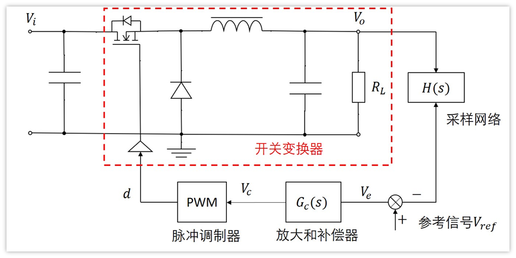


第6章第一步：把最难搞的 **MOS 管 + 二极管**看作一个整体（二端口网络），用外部行为代替内部开关的复杂细节。下面是 Buck 拓扑：

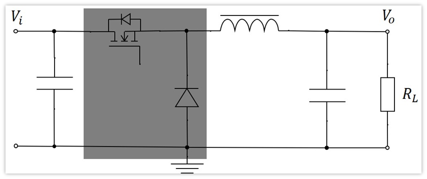

#### 端口 ≠ 端子（线）

- **端子（terminal）= 一根线**
- **端口（port）= 一对端子**（两根线，电流一进一出、大小相等，满足 KCL）

所以 **4 根线 = 4 个端子 = 2 对端子 = 2 个端口**（不是 4 端口！）

```
输入端口（端口1）          输出端口（端口2）
        │                         │
   i1 ──┤                         ├── i2
   ↓    │       二端口网络         │    ↓
   v1 ──┤                         ├── v2
        │                         │
        └──────── 地（公共）────────┘
```

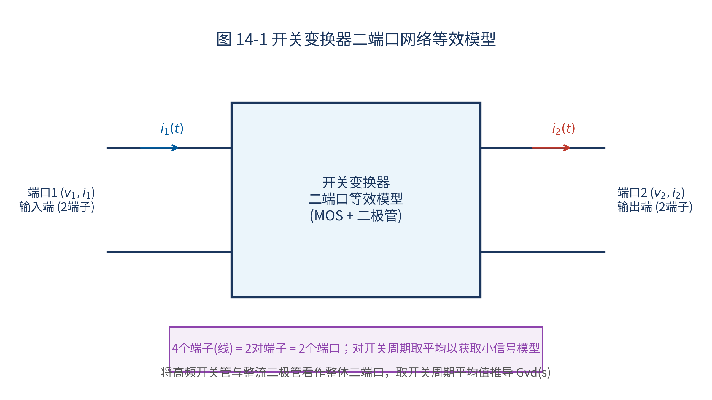
*图14-1 二端口网络等效模型：标注输入端口(V1, I1)和输出端口(V2, I2)的电压极性、电流流向，端口数=端子数÷2*

- **输入端口**：i1 从上面的线**流进**、从地线**流出**——1 对端子 = 1 个端口
- **输出端口**：i2 从上面的线**流出**、从地线**流回**——第 2 对端子 = 第 2 个端口

| 器件 | 端子数 | 端口数 | 为什么 |
|---|---|---|---|
| 一个电阻 | 2 | 1 | 两根线一进一出 |
| **MOS+二极管（本例）** | **4** | **2** | 输入 1 对 + 输出 1 对 |
| 变压器 | 4 | 2 | 原边 1 对 + 副边 1 对 |
| 三极管（小信号等效）| 3 | 2 | 输入 1 对 + 输出 1 对（共用射极）|

> 口诀：**端口数 = 端子数 ÷ 2**（每端口两线、电流成对）

#### 二端口等效的过程

把 MOS + 二极管看作一个整体（对外 4 根线 = 2 个端口）：

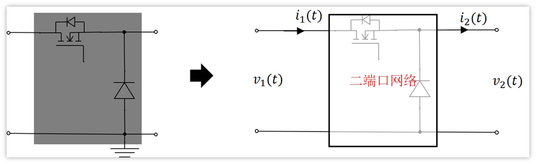

等效后的二端口电路：

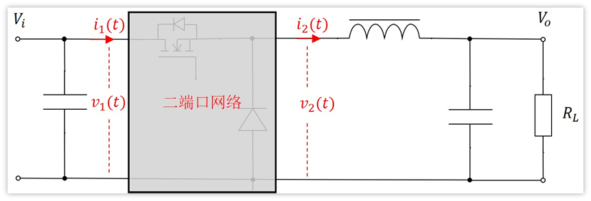

#### 为什么这么分？——把开关细节"平均"进端口

二端口网络只需关心 **4 个量**：输入端的 $V_1(t)、I_1(t)$，输出端的 $V_2(t)、I_2(t)$。

第6章后续做的事：
1. 对这四个量取**开关周期平均值**
2. 找端口参数关系（推导出两个式子）
3. 代入电路求传递函数 $G_{vd}(s)$

### 14.2 开关周期平均值 vs 总时间平均值 vs 直流分量

对二端口的 4 个量取**开关周期平均值**后（新符号 I1(t)、I2(t)、V1(t)、V2(t)，都是时间的函数）：

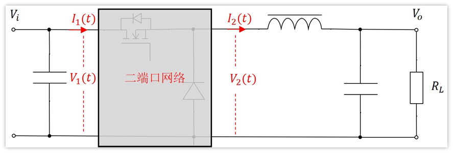

稳态（无干扰）时各量为常量；有干扰时围绕中心值波动：

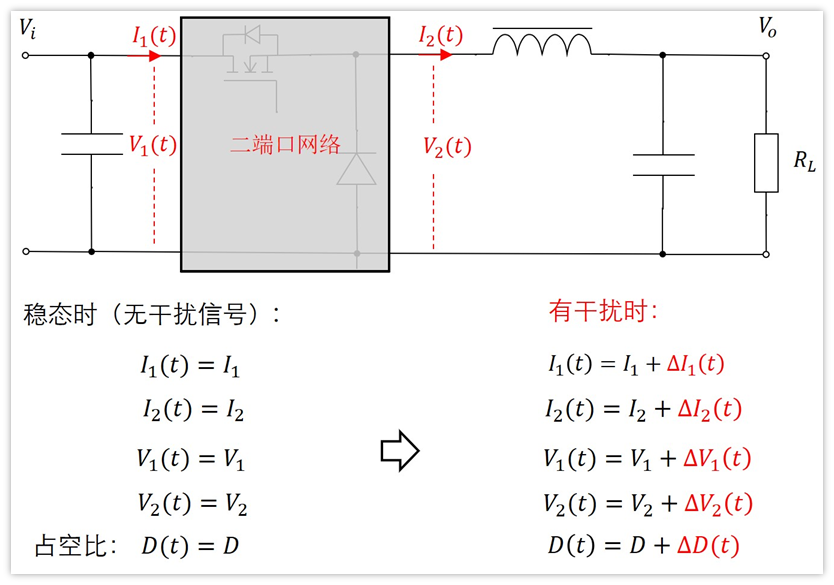

#### 原始波形是"开关"的

$v_2(t)$、$i_1(t)$ 是**开关波形**——每个开关周期内剧烈跳变（如 v2 在 MOS 导通时 = v1、关断时 = 0，是方波），天然是"时间的函数"。

#### 三种"平均"分别是什么

| 概念 | 做法 | 是否时间的函数 | 能看到什么 |
|---|---|---|---|
| **开关周期平均值** | 一个开关周期内积分取平均：$X(t)=\frac{1}{T_s}\int x\,d\tau$ | ✅ 是（慢变）| 抹平纹波，**保留干扰/慢变化** |
| **总时间平均值** | 对整段长时间取平均 | ❌ 否（一个常数）| 抹平一切 |
| **直流分量** | = 总时间平均值 | ❌ 否 | 只有静态（稳态工作点）|

#### 三者的关系

- **稳态、无干扰**：每个开关周期平均值都一样 → 开关周期平均 = 总时间平均 = 直流分量（三者相等，看起来没区别）
- **有干扰**：每个周期平均值不一样（如 1.0 → 1.1 → 1.2 → 1.1 → 1.0V）→ 开关周期平均是"时间的函数"，总时间平均只是一个数

> 类比：开关周期平均 = "每天平均气温"（能看出季节趋势）；总时间平均 = "全年平均气温"（一个数，看不出变化）

#### 直流分量 = 平均值（举例 Buck）

CCM Buck 的电感/输出电流是锯齿波：**平均值 = $I_o$ = 直流分量**；锯齿部分 = 纹波 = 交流分量。

- 输入电流平均值 = $I_o\cdot D$（只有导通期间有电流）
- 对任何量都成立：**直流分量 = 该量的总时间平均值 = 平均值**

#### 为什么分析环路必须用"开关周期平均值"？

第6章原文："我们现在分析传递函数，就是分析干扰信号的影响，自然不能只看直流等效了，所以求的是开关周期的平均值。"

- 干扰的影响体现在"**每个开关周期平均值在缓慢变化**"上
- 总时间平均（直流）把变化全抹平 → 只能做静态分析
- 开关周期平均保留变化 → 才能写出 $\Delta V_2(t)$ 等小信号量 → 才能求传递函数

> 呼应第2章**低频假设**：信号频率远低于开关频率，"周期内近似恒定、周期间缓慢变化"，取周期平均不丢信息——与第5章"一个开关周期内 Vc 恒定"是同一个道理。

### 14.3 Buck 小信号求解与 Gvd(s) 推导（完整步骤）

#### ① 端口关系（任何时候成立）

$$V_2(t)=V_1(t)\cdot D(t) \qquad I_1(t)=I_2(t)\cdot D(t)$$

为什么 V2=V1·D（MOS 导通时 v2=v1、关断时 v2=0，周期平均 = 导通占比 × V1）：


同理 I1=I2·D（MOS 导通时 i1=i2、关断时 i1=0）：


#### ② 拆成"稳态值 + 小信号"

$$V_1(t)=V_1+\Delta V_1(t),\quad V_2(t)=V_2+\Delta V_2(t),\quad I_1(t)=I_1+\Delta I_1(t),\quad I_2(t)=I_2+\Delta I_2(t),\quad D(t)=D+\Delta D(t)$$

#### ③ 代入端口关系并展开

$$V_2+\Delta V_2 = (D+\Delta D)\cdot(V_1+\Delta V_1) = D V_1 + D\Delta V_1 + \Delta D\,V_1 + \Delta D\,\Delta V_1$$
$$I_1+\Delta I_1 = (D+\Delta D)\cdot(I_2+\Delta I_2) = D I_2 + D\Delta I_2 + \Delta D\,I_2 + \Delta D\,\Delta I_2$$

小信号求解（把式子代换，忽略高阶小项）：

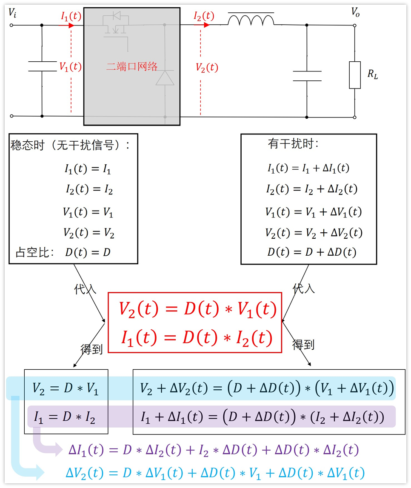

得到两个小信号式子：

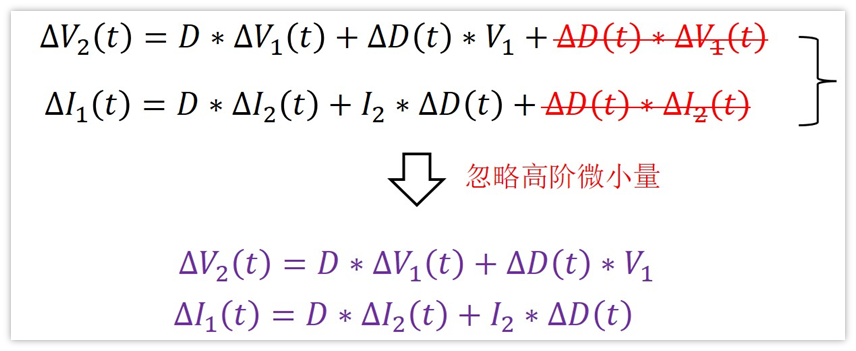

#### ④ 减稳态项（直流相消）+ 忽略高阶微小量（Δ·Δ）

稳态项 $V_2=DV_1$、$I_1=DI_2$ 两边相消；$\Delta D\cdot\Delta V_1$、$\Delta D\cdot\Delta I_2$ 是**两个小信号相乘**（二阶小量）→ 忽略：

$$\Delta V_2 = D\cdot\Delta V_1 + V_1\cdot\Delta D$$
$$\Delta I_1 = D\cdot\Delta I_2 + I_2\cdot\Delta D$$

#### ⑤ 代入 Buck 条件：输入恒定 → ΔV1 = 0

对于 Buck，只需要第一个式子即可求出传递函数：


回到 Buck 拓扑：

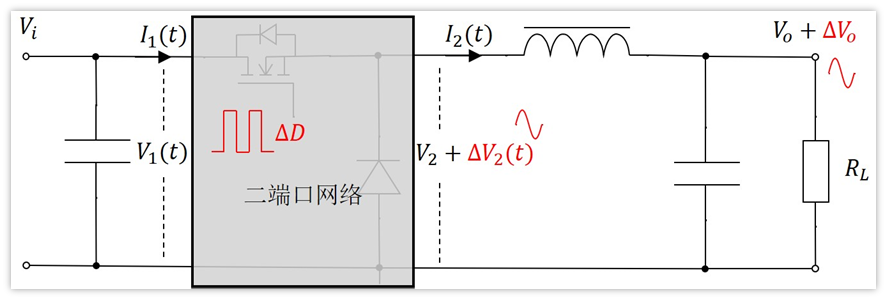

$V_1(t)=V_i$ 恒定 → $\Delta V_1(t)=0$，化简：


$$\Delta V_2 = V_i\cdot\Delta D$$

#### ⑥ ΔV2 经 LC 低通分压 → ΔVo

ΔV2 是电感前面（SW 点）的电压变化量，ΔVo 是后面 L、C、R 对它的分压：

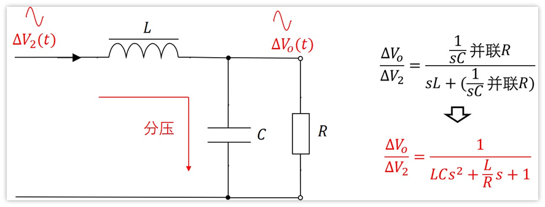

$$\frac{\Delta V_o}{\Delta V_2}=\frac{Z_C\parallel R}{sL+(Z_C\parallel R)}=\frac{1}{1+\dfrac{sL}{R}+s^2LC}$$

#### ⑦ 最终结果

$$G_{vd}(s)=\frac{\Delta V_o}{\Delta D}=\boxed{\frac{V_i}{1+\dfrac{sL}{R}+s^2LC}}$$

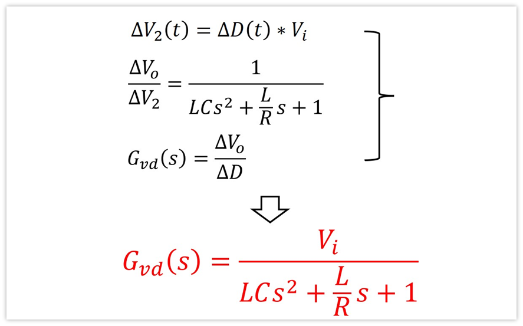

> 为什么能忽略 $\Delta\cdot\Delta$ 项？带 Δ 的量都是小信号（相对稳态值很小），两个小量相乘就更小（二阶），相对一阶项可忽略——这是小信号线性化的核心操作。

### 14.4 为什么"直流 Vi 对交流小信号相当于短路"（Boost 关键一步）

Boost 的求解过程与 Buck 相同（二端口等效 → 端口关系 → 代入电路），但肉眼看不出来，更能体现方法的价值。

Boost 二端口等效：

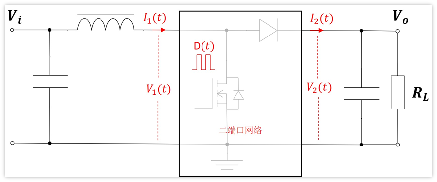

稳态与有干扰时的拆解：

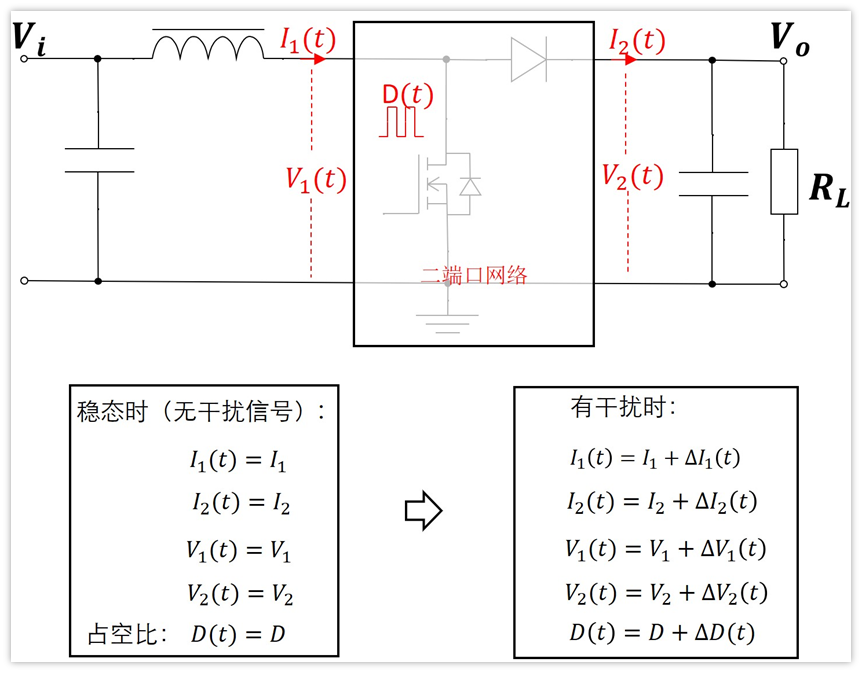

#### 原理

**理想直流电压源内阻 = 0，把两端电压"钉死"在 Vi**：

- 无论灌入多少交流电流，该点电压不变（只有直流 Vi）
- 交流小信号域里：该点**交流分量 ΔV = 0** ⟺ **交流等效接地**

> 类比：**大电容对交流也是短路**（旁路），道理相同——电压"来不及"变化，交流信号从它上面溜走；直流源更极端（内阻 0）。

#### Boost 的应用

```
        ┌─ L ─┐
  Vi ───┤     ├──── V1 + ΔV1(t) ──→ 二端口
        └─────┘
    ↑              ↑
 交流接地         交流电位 = ΔV1(t)
（ΔV=0）        （右端）
```

- 电感**左边**（接 Vi）：交流接地（ΔV=0）
- 电感**右边**：交流电位 = ΔV1(t)
- 电感复阻抗 sL，流过交流电流 ΔI1，压降 = sL·ΔI1
- 沿电流方向（左→右）压降 = 左 − 右 = $-\Delta V_1$，故：

$$\boxed{\Delta V_1 = -sL\cdot\Delta I_1}$$

（负号是**方向约定**：ΔV1 是"右端相对左端"，ΔI1 是"从左流向右"，方向相反）

#### Boost 推导的完整链路

1. 端口关系：$V_1=V_2\cdot(1-D)$，$I_2=I_1\cdot(1-D)$（MOS 关断时 v1=v2、导通时 v1=0 → 平均 = 不导通占比 × V2）：


同理 $I_2=I_1\cdot(1-D)$（MOS 关断时 i2=i1、导通时 i2=0）：


2. 小信号（同上方法）：$\Delta V_1=(1-D)\Delta V_2 - V_2\Delta D$；$\Delta I_2=(1-D)\Delta I_1 - I_1\Delta D$

小信号求解代换：

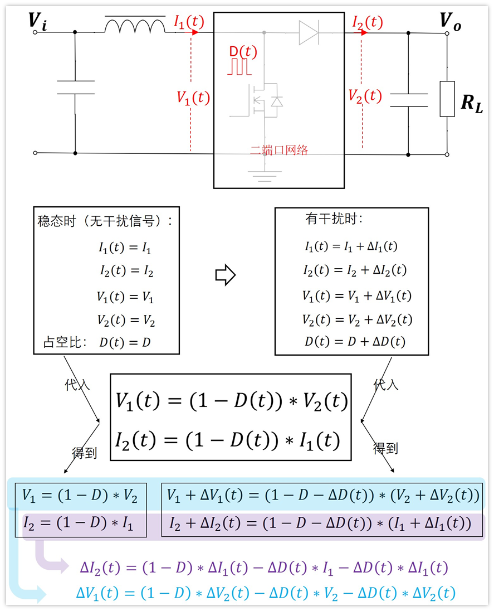

忽略高阶小项后：


回到 Boost 拓扑：

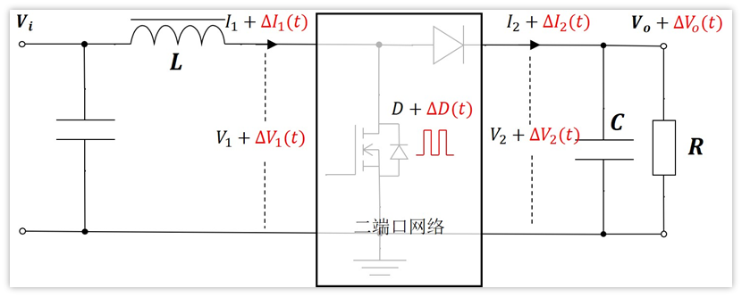

3. 输入端：直流 Vi 交流短路 → 电感左边接地，$\Delta V_1=-sL\Delta I_1$：


输出端：$\Delta V_o=\Delta V_2$，电压 = 电流 × 阻抗：


4. 输出端：$\Delta V_o=\Delta V_2$，$V_1=V_i$，$V_2=V_o$，$I_2=V_o/R$；小信号求解得到的两个公式：


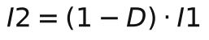
5. 汇总所有公式，消除中间量：

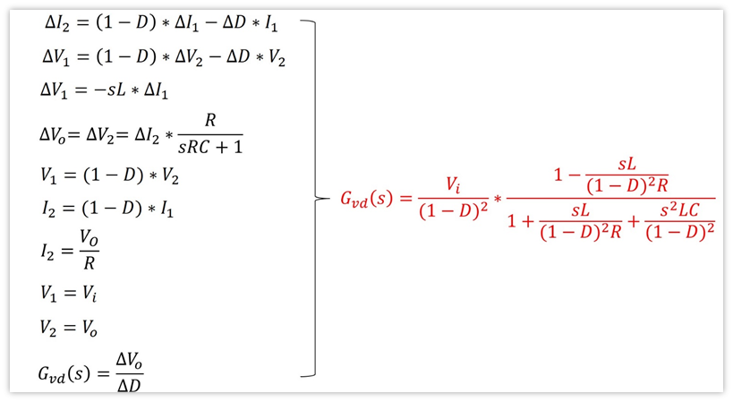

得标准结果：

$$G_{vd}(s)=\frac{V_i}{(1-D)^2}\cdot\frac{1-\dfrac{sL}{R(1-D)^2}}{1+\dfrac{sL}{R(1-D)^2}+\dfrac{s^2LC}{(1-D)^2}}$$

**分子 $(1-\frac{sL}{R(1-D)^2})$ 产生右半平面零点（RHP 零点）**：

$$f_{RHP}=\frac{R(1-D)^2}{2\pi L}$$

> RHP 零点带来**相位滞后**（帮倒忙），是 Boost/Buck-boost/**反激**环路带宽受限制的根本原因（呼应第7节笔记和穿越频率章节）。

## 15. BUCK 电源环路仿真实验验证（第7章）

### 15.1 验证思路：理论公式 vs 仿真测试

前面三章把 Buck 各级传递函数都推出来了，相乘即开环传递函数（下图）：


**4 步验证方法：**

| 步骤 | 内容 |
|---|---|
| 1. 搭好电路 | 用分立器件搭一个 Buck 电路 |
| 2. 公式法画波特图 | 按推导的公式直接列出并画出开环波特图 |
| 3. 测试法画波特图 | 仿真中注入小信号实测波特图（像现实中测环路）|
| 4. 对比 | 两者一致 → 前面的公式正确 ✅ |

### 15.2 搭建 Buck 电路

根据 Buck 系统框图搭建：

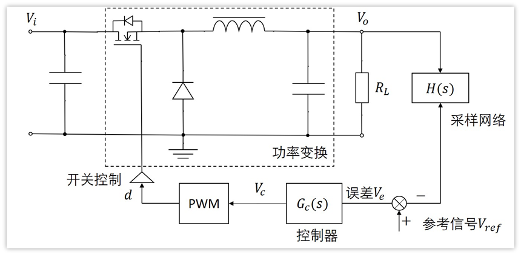

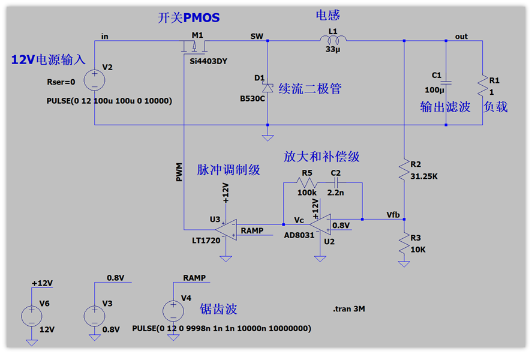

- **锯齿波 RAMP** 用电压源产生，与放大补偿后的信号比较得到 PWM；周期 10us → **开关频率 100kHz**
- Vfb=0.8V，目标输出 3.3V：R3=10k，R2=31.25k → $V_{out}=0.8\times(1+R_2/R_3)=3.3\text{V}$
- R5=100k、C2=2.2nF（随意试的值）
- 器件：PMOS **Si4403**、高速比较器 **LT1720**、放大器 **AD8031**
- ⚠️ **比较器不能用放大器替代**——速度不够，无法正确产生 PWM

运行后输出波形：3ms 后稳定在 3.3V ✅（上电瞬间飙到 8V 是初始状态未处理，不影响——只测稳定状态后的环路）：

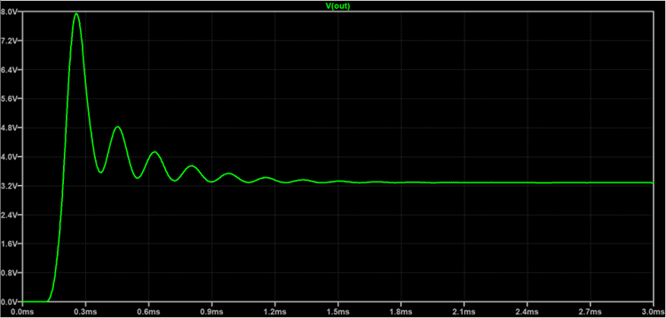

### 15.3 根据公式直接画波特图（公式法）

**① 反馈 + 误差放大级**（第4章）：

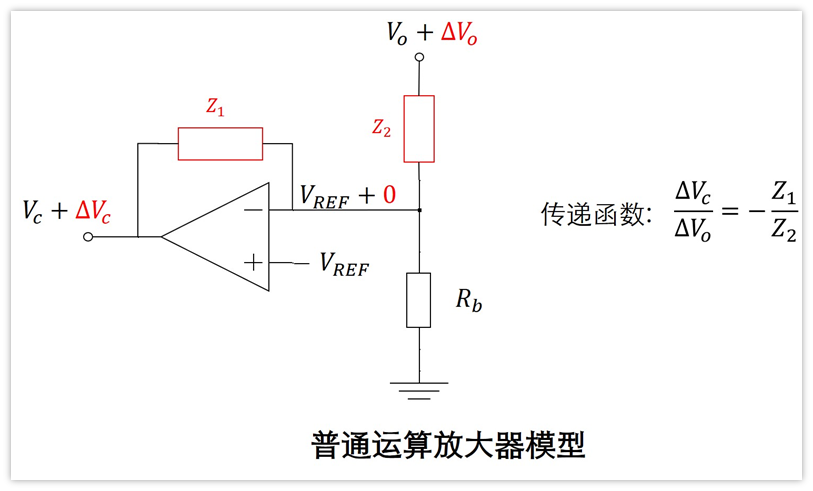

代入电路参数：

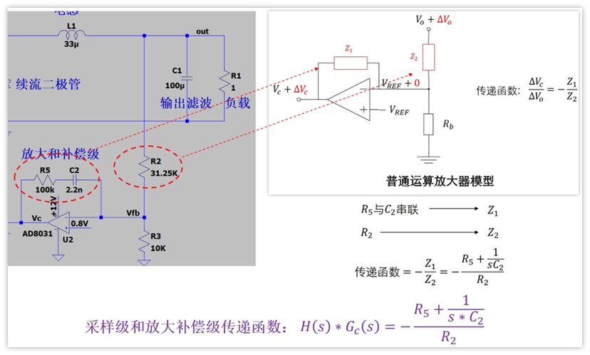

**② 脉冲调制级**（第5章），锯齿波幅值 $V_M=12\text{V}$：


**③ 开关变换级**（第6章），代入 L1=33uH、C1=100uF、R1=1Ω：


**④ 四级相乘 = 开环传递函数**：

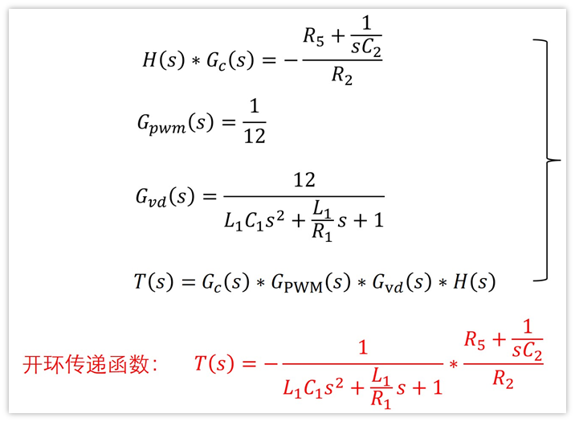

用 LTspice 画波特图（附录A方法），参数：L1=33uH、C1=100uF、C2=2.2nF、R1=1Ω、R2=31.25k、R5=100k：

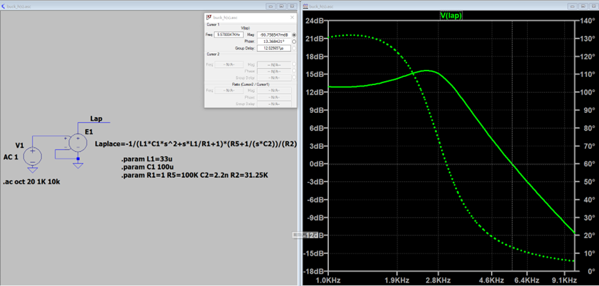

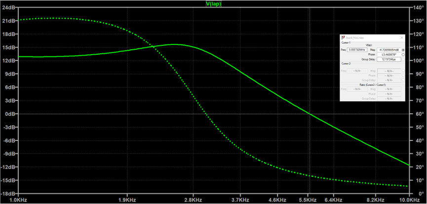

> 从公式法波特图读出：**穿越频率 = 5.56 kHz**

### 15.4 测试得到波特图（测试法）

**原理 = 现实中环路分析仪**：给环路注入正弦波小信号，输出/输入**幅度比 = 增益**、**相位差 = 相移**；小信号频率扫很多点，逐点测量连线 → 波特图（像 AD 采样，点越多曲线越平滑）。

现实测试原理（视频截图）：


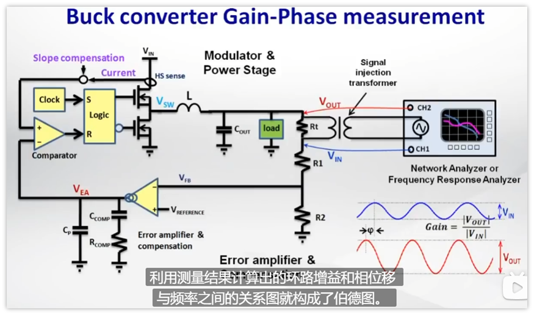

**LTspice 注入设置**：在 Vout 与上分压电阻之间加电压源注入正弦波（频率是变量 freq，幅度 20mV，太大影响正常工作）：

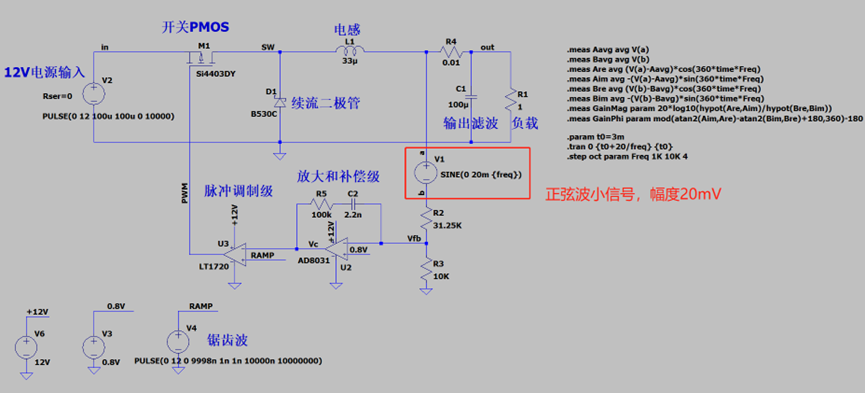

- **R4=0.01Ω 的作用**（作者踩过的坑）：隔离，避免网络 a 和 out 变成同一个网络（否则执行时一直出错）
- 把测量点命名为 a、b，粘贴 .meas 命令：

```spice
.meas Aavg avg V(a)                        ; a点电压平均值
.meas Bavg avg V(b)                        ; b点电压平均值
.meas Are avg (V(a)-Aavg)*cos(360*time*Freq) ; a点交流实部
.meas Aim avg -(V(a)-Aavg)*sin(360*time*Freq); a点交流虚部
.meas Bre avg (V(b)-Bavg)*cos(360*time*Freq) ; b点交流实部
.meas Bim avg -(V(b)-Bavg)*sin(360*time*Freq); b点交流虚部
.meas GainMag param 20*log10(hypot(Are,Aim)/hypot(Bre,Bim)) ; 增益
.meas GainPhi param mod(atan2(Aim,Are)-atan2(Bim,Bre)+180,360)-180 ; 相位
```

```spice
.param t0=3m                       ; 系统稳定所需时间（3ms）
.tran 0 {t0+20/freq} {t0}          ; 3ms后开始测试，测20个周期
.step oct param Freq 1K 10K 4      ; 测1k~10k，每倍频程4个点
```

- **t0=3ms**：前面运行已知 3ms 后系统稳定（不同系统不同，太长会拖慢仿真）
- **频率范围 1k~10k**：已知穿越频率约 5k，不设太大（仿真时间短）

### 15.5 仿真运行与操作步骤

运行约 3 分钟，窗口左下角看进度 **Run：1/15**（共测 15 个频点）：

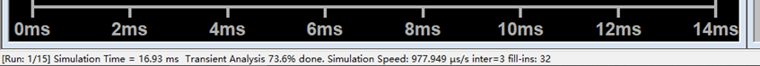

运行结束后波形窗口无波形，需 4 步操作：

**步骤1**：波形窗口右键 → View → **SPICE Error Log**

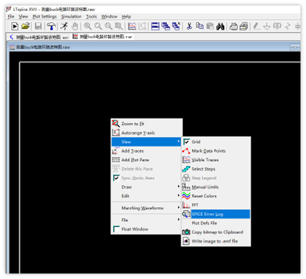

**步骤2**：log 窗口右键 → **Plot .step'ed .meas data** → 选"是"

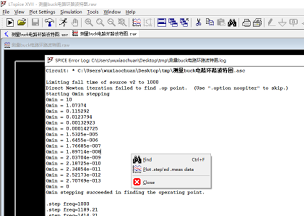

**步骤3**：弹出窗口右键 → View → **Visible Traces**

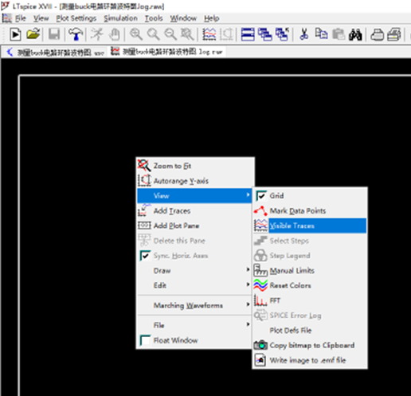

**步骤4**：选择 **gain** → 生成波特图

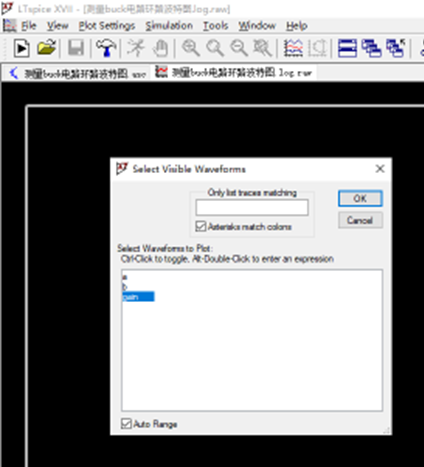

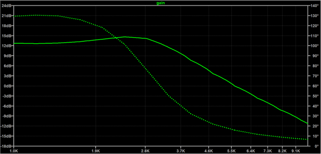

### 15.6 对比验证

公式法 vs 测试法波特图对比：

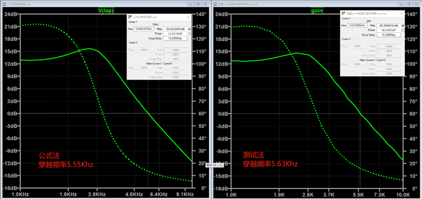

> 两者波形**基本一样** → 验证了第4/5/6章推导的传递函数是**正确**的 ✅

### 15.7 小结

- 用 LTspice 完成了"公式法"与"测试法"的双重验证
- 仿真较复杂，需耐心折腾
- 源文件：公众号"硬件工程师炼成之路"回复"炼成之路" → 目录：电源/开关电源传递函数/Buck电源环路仿真实验验证

## 16. 前6章自测题（含参考答案）

> 先自己作答，再点击"查看答案"展开对照。覆盖第2~6章核心概念。

### 一、第2章 · 线性化条件

**Q1.** 开关电源当线性系统分析需要满足哪三个条件？

<details>
<summary>查看答案</summary>

1. **低频假设**：干扰信号频率 < 开关频率 1/2（采样率=开关频率，奈奎斯特采样定理）
2. **小信号假设**：干扰幅度小，占空比只在小范围变化
3. **小纹波假设**：输出纹波远小于直流平均值，可忽略

</details>

**Q2.** 为什么穿越频率要 < 开关频率 1/2？

<details>
<summary>查看答案</summary>

脉冲调制器像 AD 采样，**采样率 = 开关频率**。穿越频率是环路里最高的有用频率，若 ≥ 开关频率 1/2 → **采样失真（混叠）** → 系统不能当线性看，穿越频率概念本身失去意义。

</details>

**Q3.** 为什么纹波太大会导致建模不准？

<details>
<summary>查看答案</summary>

① 平均值不再代表输出；② 更关键：反馈（TL431/光耦）采样到"一直抖动的电压"→ 误差放大器跟着抖 → 环路行为乱。纹波小，反馈看到近似稳定的直流，环路才正常工作。

</details>

### 二、第3章 · 系统框图

**Q4.** 反馈系统的"有用输入"是 Vi 还是 Vref？Vi 扮演什么角色？

<details>
<summary>查看答案</summary>

- 有用输入 = **Vref**（按偏差控制，目标是 Vo 恒定，不随 Vi 变）
- **Vi = 系统的工作条件 / 静态工作点**（类比三极管放大电路）：Vi 不同 → 占空比、传递函数不同；Vi 的噪声才是扰动输入

</details>

**Q5.** 为什么系统框图上信号都带 △ 符号？

<details>
<summary>查看答案</summary>

△ 表示**相对稳态工作点的变化量（小信号）**。因为线性化要求**小信号假设**，每个量都写成"稳态值 + △变化量"。

</details>

**Q6.** 为什么画开环 T(s) 而不是闭环 C(s) 的波特图？

<details>
<summary>查看答案</summary>

1. 对数坐标下开环各级**相乘 → 幅度相加、相位相加**，可逐级分解分析各级作用
2. 闭环 logC = logG − log(1+T)，**拆不开**
3. 稳定性判据 1+T=0 由开环 T 决定

</details>

**Q7.** "开环 = 去掉反馈，T(s) = G(s)" 对吗？

<details>
<summary>查看答案</summary>

**不对**。开环 T(s) = G(s)·H(s) 是**把环路剪断后，信号绕一圈回到断口的增益**——H(s) 仍在回路里作为被测对象。它衡量的是信号绕一圈放大/相移多少（不是"系统输入→输出"）。

</details>

### 三、第4章 · 两种误差放大器

**Q8.** 两种放大器对分压电阻的影响？根本原因？

<details>
<summary>查看答案</summary>

- 普通放大器：**只有上电阻影响**（下电阻 Rb 不影响）
- 跨导放大器：**两个电阻都影响**

根本原因在输入端：普通放大器**虚短成立**（反相端被钉在 Vref，Rb 两端电压/电流恒定，不影响交流路径）；跨导放大器**没有虚短**（只有虚断），分压比 Rd/(Zin+Rd) 直接进传递函数。

</details>

**Q9.** gm 的单位？为什么补偿电路在 Zo？

<details>
<summary>查看答案</summary>

- gm 单位 = **A/V**（输出电流/输入电压）= 导纳 = 西门子 S（**不是 V/A，容易记反**）
- 跨导放大器输出是**电流源（高阻）**，电流必须流过输出端阻抗 Zo 才能变成电压 $V_c = I\cdot Z_o$ → **Zo 就是补偿网络**。普通放大器输出是电压源，补偿靠反馈阻抗 Z1。

</details>

**Q10.** 三种补偿的零极点？

<details>
<summary>查看答案</summary>

| 补偿 | 零极点 |
|---|---|
| 主极点（C1）| 原点极点，**无零点** |
| 极零点（R2+C1）= **PI** | 原点极点 + 1 零点 $f_z=\dfrac{1}{2\pi R_2C_1}$ |
| 双极点单零点（C2∥R2+C1）| 原点极点 + 1 零点 + 1 高频极点 $f_p\approx\dfrac{1}{2\pi R_2C_2}$（C1≫C2）|

fp 由 **R2 和 C2** 决定（是公式，不是实测值）。

</details>

### 四、第5章 · 脉冲调制级

**Q11.** Gpwm(s) = ？

<details>
<summary>查看答案</summary>

- 占空比 $d = \dfrac{V_c}{V_m}$（Vc 越大占空比越大）
- $G_{pwm}(s) = \dfrac{\hat d}{\hat v_c} = \dfrac{1}{V_m}$（锯齿波峰值 Vm 的倒数）

</details>

**Q12.** 为什么一个开关周期内可把 Vc 看作恒定？对应哪个条件？

<details>
<summary>查看答案</summary>

锯齿波频率 = 开关频率 **远大于** Vc 的频率（穿越频率 < 开关频率 1/5）→ 一个周期内 Vc 几乎不变。对应**低频假设/采样定理**（不是纹波条件）。

</details>

### 五、第6章 · 开关变换器

**Q13.** 为什么用"开关周期平均"而不是"总时间平均"？

<details>
<summary>查看答案</summary>

干扰是小信号慢变化，它的影响体现在"**每个开关周期平均值在缓慢变化**"上（开关周期平均值是时间的函数）；总时间平均把所有周期再平均成一个直流数，**看不到干扰的影响**，只能做静态分析。

</details>

**Q14.** 为什么 MOS+二极管是"二端口"而不是"四端口"？

<details>
<summary>查看答案</summary>

**端口 = 一对端子**（电流一进一出、满足 KCL）。4 根线 = 2 对端子 = **2 个端口**（输入端口 + 输出端口）。

</details>

**Q15.** 为什么能忽略 Δ·Δ 项？

<details>
<summary>查看答案</summary>

带 Δ 的都是小信号（相对稳态值很小），两个小信号相乘 = **二阶小量**，比一阶项小得多 → 忽略。这是小信号线性化的核心操作。

</details>

**Q16.** Buck / Boost 的 Gvd(s)？

<details>
<summary>查看答案</summary>

- **Buck**：$G_{vd}=\dfrac{V_i}{1+\dfrac{sL}{R}+s^2LC}$
- **Boost**：$G_{vd}=\dfrac{V_i}{(1-D)^2}\cdot\dfrac{1-\dfrac{sL}{R(1-D)^2}}{1+\dfrac{sL}{R(1-D)^2}+\dfrac{s^2LC}{(1-D)^2}}$
- Boost 分子 $(1-\frac{sL}{R(1-D)^2})$ → **RHP 零点** $f_{RHP}=\dfrac{R(1-D)^2}{2\pi L}$，带来相位滞后、限制带宽（**反激同理**）

</details>

### 附加挑战题

**Q17.** 写出四级相乘 T(s) 及各环节量纲？为什么 T(s) 必须无量纲？

<details>
<summary>查看答案</summary>

$$T(s) = H(s)\cdot G_c(s)\cdot G_{pwm}(s)\cdot G_{vd}(s)$$

- H、Gc：V/V → 无量纲；Gpwm：**1/V**；Gvd：**V**
- 相乘后量纲抵消 → T(s) 无量纲。因为 0dB 只能对**无量纲比值**取对数，T 带单位则 0dB 失去意义。

</details>

**Q18.** 判断对错（并说明）

<details>
<summary>查看答案</summary>

- (a) ✗ 直流电压源对交流小信号 = **短路**（不是开路，内阻 0、ΔV=0）
- (b) ✗ 积分器（原点极点）增益随频率**下降**（-20dB/dec，不是上升）
- (c) ✓ 极零点补偿本质上就是 PI 控制器
- (d) ✓ 普通放大器时，分压网络下电阻不影响环路稳定性
- (e) ✗ 闭环 logC = logG − log(1+T) **拆不开**；能逐级分解的是**开环**

</details>

